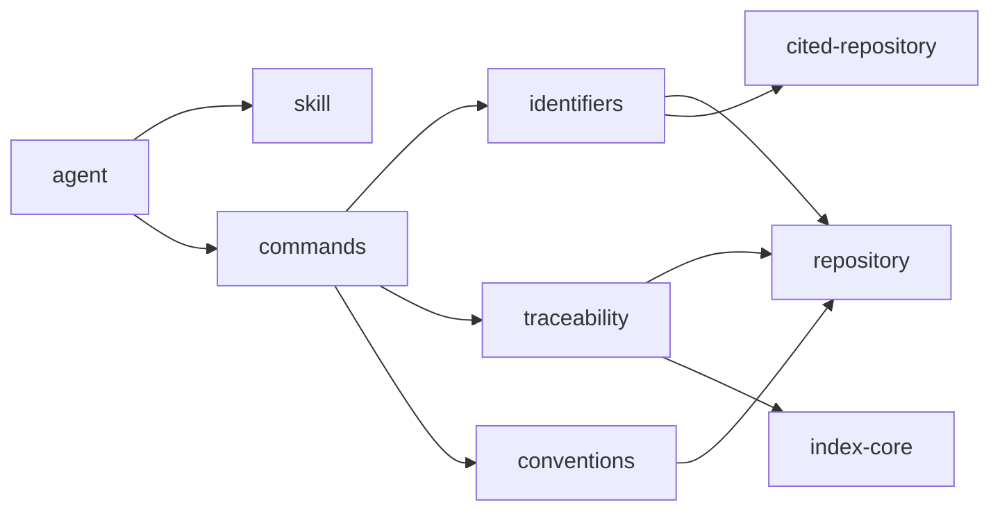

# Railyard Method

**You should always know why your code exists — and when it stops being right.**

Agents now write code faster than anyone can read it. That's the opportunity and the risk. A
week of agent work can produce a month of code, and a month of decisions nobody wrote down:
the requirement a function was written for, the constraint it was honouring, the reason it
looks the way it does. All of it lived in a context window, and the context window closed
when the session ended.

We believe the people who own software have to be able to answer two questions about any line
of it, at any time: **why is this here?** and **is it still right?** Without those answers you
can't change code safely, you can't review it honestly, and you can't trust what an agent
built on your behalf. You can only hope.

**So Railyard Method keeps the answers.** It holds the link between your requirements and the
code written for them, and tells you when the two have drifted apart.

It's a Claude Code skill that teaches an agent to work this way, and the tools that turn those
links into something you can ask about. It came out of Railyard, a product built this way, and
needs nothing from it.

## Here's what that looks like

Ask one line of this repository's own source why it exists. From a clone of it:

```console
$ node skills/spec-driven-change/tools/railyard.mjs trace backward ids/elsewhere.ts:15
ids/elsewhere.ts:15 at 4a4166c1ce40 (2026-09-27 10:44 -07:00)
  | // What it cannot check it says it cannot check ([9p5]): an undeclared name or a commit the
last changed in fa032f9d1713 (2026-09-24 11:11 -07:00) by Nick: A repository the reader cannot reach is a notice, not a failure
  Co-Authored-By: Claude Opus 5.5 (1M context) <noreply@anthropic.com>
  Claude-Session: https://claude.ai/code/session_01TjNnpFsj5mYtCJhMoCW9W5

recorded  architecture-source-path  CALM node `identifiers` (docs/architecture/method.json#identifiers) @ 03fd8d0b22a5 (2026-09-23 15:14 -07:00)  current  at docs/architecture/method.json:34 (03fd8d0b22a5)
cited     code-citation             [Bvq] (docs/specs/traceability.md) @ d60cf166d332 (2026-09-23 13:29 -07:00)  current  at ids/elsewhere.ts:4 (0361ad7a663d)
cited     code-citation             [2sV] (docs/principles/principles.md) @ 603237bad804 (2026-09-23 11:42 -07:00)  suspect: changed since the link was made, now 43b351c62781 (2026-09-24 10:09 -07:00)  at ids/elsewhere.ts:9 (0361ad7a663d)
cited     code-citation             [QBm] (docs/specs/traceability.md) @ d60cf166d332 (2026-09-23 13:29 -07:00)  suspect: changed since the link was made, now 64046c9b269b (2026-09-24 09:57 -07:00)  at ids/elsewhere.ts:12 (0361ad7a663d)
cited     code-citation             [9p5] (docs/principles/principles.md) @ 43b351c62781 (2026-09-24 10:09 -07:00)  current  at ids/elsewhere.ts:15 (fa032f9d1713)
cited     commit-message            [v0F] (docs/specs/artifacts.md) @ 64046c9b269b (2026-09-24 09:57 -07:00)  suspect: changed since the link was made, now 4d94dfe14512 (2026-09-24 19:13 -07:00)  in commit fa032f9d1713
```

*(Real output, complete. The lines are long: the end of each says where the link was read.)*

It answers the first question: this line belongs to the architecture model's `identifiers`
component, implements the requirement [Bvq] cited at the top of its file, and honours the
principle [9p5] cited on the line itself, *absence of signal is not evidence of health*. Then it
answers the second, which nobody asked out loud and no reviewer would have caught: two other
requirements the same comment cites, and one the commit that wrote it cites, **changed after
the code was written**. The code may no longer be what they ask for, and the trace says which
to reread.

## Why specs alone don't get you there

Spec-driven development works: write the spec, keep it current, generate the code from it.
What it doesn't do is hold a system together as it grows. Each spec describes one feature.
None of them describes how the pieces fit: which component owns what, where the boundaries
are, what is allowed to depend on what. So every generation makes choices that are sensible
on their own, and the architecture becomes whatever those choices add up to.

By the time there are thirty specs, nobody can hold the system in their head, person or
agent. A change to one spec quietly breaks an assumption another relies on, and nothing says
so until something fails. Writing requirements down was never the hard part. Seeing the whole
system, and what a change to one part does to the rest, is.

So Railyard Method adds what a stack of specs is missing: an **architecture model** the code
is checked against, and a **link from each piece of code to the requirements it implements**.
You can see where a change lands before you make it, and which code answers to a requirement
once you have.

## Where the spec stops

Specs also get asked to hold everything: requirements, design notes, data structures, a
decision someone made on a Tuesday, the plan for next sprint. A
document that holds everything changes for every reason, and before long nobody can tell which
parts still bind.

Railyard Method gives each kind of knowledge its own artifact, split by what it says and how
fast it changes:

| | What it holds | Changes when |
|---|---|---|
| **Principles** | the rules every decision answers to | almost never |
| **Architecture model** | components, their boundaries and interfaces, and which code belongs to each — a [FINOS CALM](https://calm.finos.org) model, not a diagram | the structure does |
| **Specifications** | what the system must do, observably: acceptance criteria and measurable requirements, each with a test | the behaviour does |
| **Waymarks** | the few *hows* worth marking for whoever comes next | the ground does |

And a rule for where the line falls: **a spec says what, never how.** When a technical choice
seems to need writing down, ask why it matters until the answer is something the product
requires, and write *that* instead. Most "design decisions" turn out to be requirements nobody
stated — and once the requirement is written, the choice beneath it usually stops mattering.

A *how* earns a waymark only when two competent people could get it differently and it would
cost something. There are three kinds, and only one is really a decision:

- **Forced** — only one thing works, because software you don't control decides it. Marked with
  the date and version it was observed at, because it's a fact about someone else's code and it
  expires.
- **Conventional** — many things work and none is better, but everyone has to pick the same one.
- **Hard-won** — several routes look fine and some are traps, with the cost arriving later and
  somewhere else. Marked with the hazard, what it cost, and the evidence.

That's why they aren't called decision records: most of them record no decision. A waymark is a
mark left on a route so the next traveller doesn't find the drop the hard way. Everything else
isn't written at all. It's the implementation's business, and the tests hold it.

That separation is also what makes the tracing precise. A line of code can answer to the
component that owns it, the criterion it satisfies and the waymark that warned it off a trap —
three different questions, with three different answers, from three places that each change
for their own reasons.

## Artifacts that change as the software does

Software gets rewritten; its documents usually don't. The common answer is records you never
edit, only supersede with new ones. That keeps a history, but leaves every reader to work out
which of forty records still holds.

Railyard Method treats every artifact as desired state. The spec says what should be true *now*,
the architecture model what the structure should be *now*, and when either changes it's edited
where it stands — waymarks and principles included. Git keeps the history; the artifact keeps
the truth. The gap between what the artifacts say and what the code does is the work, and an
agent closes it.

That only works if references survive the editing. "Criterion 7" goes wrong the moment someone
inserts a criterion above it, and nothing fails — it still names a real criterion, just a
different one. A file path breaks the day a spec is renamed or split in two. So every artifact,
and every numbered item in one — each criterion, principle and waymark — carries a
three-character identifier, set once and never changed:

```markdown
7. [Ay4] An export of more than 10,000 rows runs in the background and emails its link.
```

Rewrite the text around `[Ay4]`, renumber the list, move it to another spec: the code, the
tests each spec lists by the identifiers of the criteria they hold, and the commits that cite
it still land on it. An identifier is never reused, not even one that only history or an old
commit message still mentions, so an old citation can go dead but can never quietly start
meaning something else. And because the tracing follows the
identifier rather than the position, it can tell *the requirement you cited has changed* from
*the requirement you cited is gone*: a link shown *suspect*, as in the traces here, or
*missing*.

The identifiers are arbitrary on purpose. A meaningful name — `auth-timeout` — goes stale the
moment the requirement it names moves on, and then it has to be renamed, which is the one thing
a reference must never need.

## What else makes it different

### Its links are files in your repository

Nothing lives outside the repository to keep in sync. Much of what it traces is what a
well-kept repository already records — citations in the code, the architecture model's source
paths, commit messages, the tests each spec lists — and it assembles those links when you ask.
The links an agent adds as it writes code are committed beside it, one file per source file
under `symbols/links/`. The tools write them, a scan after every write says which have gone
stale, and `check` says which files have none. `trace index` writes an index of each commit's
links under `symbols/`, committed with the rest, so a build you shipped can be traced without
the repository.

### It works in both directions

Ask a requirement or a principle what implements it, and see everything a change to it will
touch before you make the change:

```console
$ node skills/spec-driven-change/tools/railyard.mjs trace forward 9p5
[9p5] (docs/principles/principles.md) at 8e08873e432d (2026-09-27 10:47 -07:00)
  its current version: 43b351c62781 (2026-09-24 10:09 -07:00)

cited     code-citation             ids/elsewhere.ts:15-18  [9p5] (docs/principles/principles.md) @ 43b351c62781 (2026-09-24 10:09 -07:00)  current  at ids/elsewhere.ts:15 (fa032f9d1713)
cited     code-citation             method/architecture.ts:189-190  [9p5] (docs/principles/principles.md) @ 43b351c62781 (2026-09-24 10:09 -07:00)  current  at method/architecture.ts:189 (e67a5614c5e4)
cited     code-citation             method/check-cli.ts:6-7  [9p5] (docs/principles/principles.md) @ 603237bad804 (2026-09-23 11:42 -07:00)  suspect: changed since the link was made, now 43b351c62781 (2026-09-24 10:09 -07:00)  at method/check-cli.ts:6 (8ddc59eaf27f)
cited     code-citation             README.md:30  [9p5] (docs/principles/principles.md) @ 43b351c62781 (2026-09-24 10:09 -07:00)  current  at README.md:30 (ebab801041ae)
```

Three places in the code answer to that principle. Two cite it as it reads now. The third,
where `check` decides its exit code, was written against an earlier wording, and shows as
*suspect* until someone reads the two side by side. The fourth row is this README, quoting that
line in the trace above: a mention, and shown as nothing more.

### It never overstates what it knows

Every link says how it is known: *recorded* when it was made alongside the code, or placed
there by the architecture model, and *cited* when something only mentions it. A mention is
never presented as proof. A tool that blurs these gives confident answers that aren't true,
which is worse than no answer. Two stronger kinds, *tested* and *confirmed*, are not built yet,
and [Not yet](#not-yet) says so.

### It follows code into production

`trace stamp` writes a hash into what you build and ship. Given a deployed artifact and
its symbols, `backward --symbols` traces it to its requirements with no repository and no git.

### It has opinions, and holds them to evidence

It isn't neutral. It holds that artifacts change before code, that most technical decisions are
requirements nobody has stated yet, that a criterion without a test is a wish, and that when
spec and code disagree you report it rather than quietly fixing whichever side is convenient.

Those opinions are prose, and prose has no compiler — "clearer" and "changes what the agent
does" look the same on the page. So the skill ships with evaluations: every section of it has a
case, a real agent runs each case with the skill and without it, and every run's scores are
recorded in [`evals/RESULTS.md`](evals/RESULTS.md). Most cases show the skill changing what the
agent does. Some show no measurable difference yet, because the agent without the skill already
does what the rule asks; a case the baseline gets fully right can't show what a rule adds, so
that is an untested rule, not a proven one or a useless one. The difference is measured and
recorded, not enforced: nothing yet removes a rule for failing to show one.

## Who it's for

Anyone building with agents who keeps specs and wants them to stay true — one person or a team.
It pays off most where requirements change often, and where someone has to stand behind what
ships.

**Who it isn't for:** if you want a method that stays out of your way, or you don't keep specs
at all, this will feel like ceremony. It's deliberately strict about where artifacts live and
how they're cited, because that strictness is what makes the tracing work.

## What's in it

A skill, and the tools it carries. An agent working in your repository reads the skill and
runs its commands from the skill's own folder: one for stable identifiers, one for tracing,
one that checks the repository against the method, and one that carries it forward when the
method changes.



This view is drawn from the method's own architecture model, and a test fails if it ever
names something the model does not have. The method holds itself to the rules it teaches.

## Install

Get the skill, then run its `install` from your repository's root:

```sh
git clone https://github.com/nickkoza/Railyard-Method
cd your-repository
node path/to/Railyard-Method/skills/spec-driven-change/tools/railyard.mjs install
```

It copies the skill into `.claude/skills/`, records the method's version in
`.railyard/method.json`, and adds the scan to `.claude/settings.json`, with the permissions
the skill and its tools need, keeping everything else there. The scan runs on every write, a shell
command's as well as an edit's, in every session started in the repository, so links are kept as the code is written, not left
to an agent remembering to. Commit what it writes. Run again, it changes nothing.
`.claude/skills/` then holds generated files, the tools' 700 KB bundle among them: the bundle
turns ESLint off for itself, and any other linter or formatter run at the root should skip
the folder.

With the skill in `~/.claude/skills/` instead, ask the agent to install it in the project:
the skill tells it to. The tools need Node 24 and git, and nothing else installed, except
that `check` validates an architecture model with the CALM CLI (see [Checking](#checking)).
Install it with your environment rather than by hand where you can: anything installed by
hand eventually isn't, and an agent working without the method doesn't announce itself. It
just produces work that looks like work.

## Use

The tools are one file in the skill's folder. The agent runs them as the skill describes, and
so can you:

```sh
T=.claude/skills/spec-driven-change/tools/railyard.mjs
node $T ids-take 3                  # three identifiers nothing in the repository uses yet
node $T ids-resolve Ay4             # what [Ay4] names, and its opening words
node $T check                       # every check the method holds the repository to
node $T trace src/app.ts:42         # why does this line exist? (trace backward, said in full)
node $T trace Ay4                   # what implements this? An ID, bare or [Ay4]; trace forward also takes a file
node $T upgrade                     # carry the repository to this version of the method
node $T install                     # install the skill and its scan in this repository
node $T tests-by-id --dry-run      # which Tests rows name criteria by number, and the IDs they'd carry to
node $T decisions-by-id --dry-run  # which decisions carry no ID, and which it cannot be sure of
node $T links src/app.ts            # what each named thing in a file implements, and whether it still does
node $T link src/app.ts#spin Ay4    # record that spin implements [Ay4]; again, after a change, to say it still does
node $T unlink src/app.ts#spin Ay4  # remove that link, or every link of spin with no ID given
node $T scan src/app.ts             # what a change did to the file's links: what the scan says after a write
```

### Where artifacts live

Four paths, all under `docs/`, fixed:

```
docs/specs/         specifications         .md, directly under
docs/waymarks/      waymarks               .md, directly under
docs/principles/    principles             .md, directly under
docs/architecture/  architecture models    .json, directly under
```

They're arbitrary, and that's exactly why they're fixed: their whole value is that everyone
picks the same ones, so any repository laid out this way is readable by the tools, and by any
other tool that follows the method, with nothing to configure.

### Identifiers

Write an identifier after the ordinal, as in `7. [Ay4] …`, and cite it in brackets anywhere
else: code comments, commit messages, other artifacts. Cite another repository's artifact
with the repository's name and the commit you read, as `[method@<commit>:XLT]` with the
commit's hash, abbreviated to five characters or more, in place of `<commit>`, after declaring
the name once in `.railyard/method.json`:

```json
{ "method": "1.0.0", "repositories": { "method": "https://github.com/nickkoza/Railyard-Method" } }
```

### Checking

`check` reports each finding with its rule and its file, and exits non-zero on any: an
artifact missing its ID, a citation that names nothing or is written by position, a
criterion no test row names, a file the architecture model does not own, an import across a
boundary the model does not declare, a diagram not drawn from the model, a citation of
another repository that does not resolve. It changes nothing.

Every tool runs with Node and git alone, except one part of `check`: it validates each architecture
model with the [CALM CLI](https://www.npmjs.com/package/@finos/calm-cli), from the
repository's `node_modules` or the `PATH`. Where there is none it says so, as a finding, and
runs every other check. The repository need not be a Node project: `npm install -g
@finos/calm-cli` puts it on the `PATH`, and `npx @finos/calm-cli validate` runs it once by hand.

### Tracing

`trace` reads only the repository you point it at, writes nothing to it, and needs no
server. Add `--json` to any query for machine-readable output. `trace index --symbols symbols/`
records the current commit's links, and `trace stamp` writes a hash into what you build and
ship, so a deployed artifact traces back with no repository at all.

### The method version

A repository records which version of the method it follows, in `.railyard/method.json`. A
newer version of the skill reads it and carries the repository forward with `upgrade`: if a
convention changes, the artifacts are moved and every file of yours that still names an old
path is listed for you to fix. A version it doesn't recognise is refused, and nothing is
touched. The same file names the documents that record a moment, so no check rewrites them:

```json
{ "method": "1.0.0", "dated": ["docs/reviews/", "evals/RESULTS.md"] }
```

### Not yet

- A link is never yet *tested* (shown by a criterion's tests running the line) or *confirmed*
  (a person saying it is right). Every link is recorded or cited, and says which.
- The derived index's Rust core is built but not yet shipped as WebAssembly.
- A trace does not yet follow a citation into another repository; `check` does resolve one.

## Changing the method

You don't need this to use the skill. It's for proposing a change to the method itself, from a
clone of this repository:

```sh
npm ci
npm test         # the tests
npm run check    # the method's own checks, run on itself
npm run evals    # the skill's evaluations, with the skill and without it
```

`npm run evals` runs Claude Code's `claude plugin eval` over every case with the skill and
without it, fails below a score of 0.8, and has Sonnet judge the answers: the default judge
passed weak answers and failed right ones, so it isn't used. The evaluations call a real model
on your credential and cost money, so run them when you change the skill or its cases, not on
every commit. `npm run evals:summary` adds a run's scores to `evals/RESULTS.md`.

## Licence

MIT. See [LICENSE](LICENSE). Railyard itself is licensed separately.
