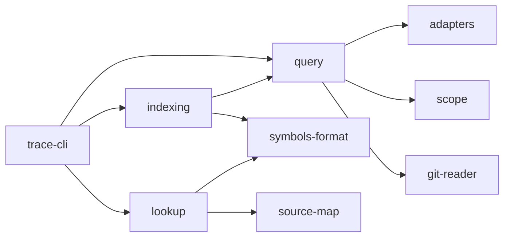
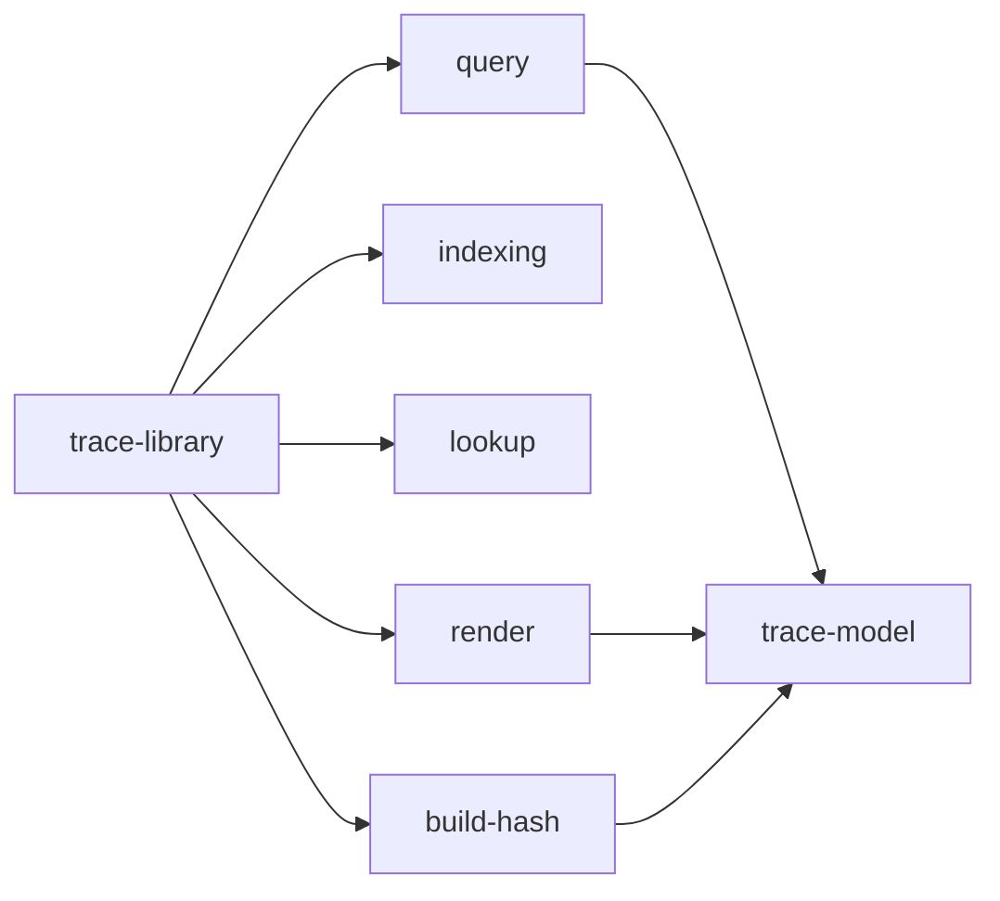

# Traceability

**Type:** Capability spec, standalone · **Status:** Draft · **Source:** the owner, 2026-09-15, drawing on research notes and decisions from the owner's own application, written before this repository existed · **ID:** [irC]

## Purpose

Traceability ties what was built back to the artifacts that caused it, and those
artifacts forward to everything built from them.
- **Backward:** from a line of code, an element of a running page, or a running
  deployment, to the specs, criteria, waymarks and architecture nodes that asked for it.
- **Forward:** from any of those artifacts to every piece of code, every page element and
  every deployment that traces to it.

It is how the owner sees how a spec-driven application fits together.

It stands on its own. Its format is open, and meant to be adoptable as a standard
beyond Railyard. Its tools work without Railyard or any server, and Railyard is one
producer and consumer of it among others.

It is agnostic by construction:
- only a build hash rides in the built application;
- nothing depends on a language, a framework or a build tool.

Each generated version of the application has a *symbols file*, kept beside its source
as debug symbols are kept beside a binary. It records positions in the source, and each
position's links back.

**The comparison is the design, not a turn of phrase.** A C or
C++ build ships stripped, because its symbols leak implementation detail; the symbols
are kept elsewhere because they are invaluable when debugging; and a build-id joins the
two. Here exactly: what ships carries no artifact reference ([Cz9]), the symbols
live outside it, and the build hash is the build-id that joins them ([DHL]).

**One difference sets the rest of this spec.** Debug symbols are *derived* — a compiler
rebuilds them from source, so a lost `.pdb` costs a rebuild and nothing more. These are
*authored*: why the code is as it is, and which requirement it serves, exist only while
it is being written, and nothing recomputes intent. Losing them is therefore
unrecoverable rather than inconvenient — which is why they are checked in ([LRA]),
why keeping them true is the obligation of whoever changes a file rather than of a batch
job ([G0i]), and why a wholesale regenerate is inference rather than derivation
([Zs7]).

### How an index is written and a query answered

For whoever changes the tool: which parts a query passes through, and where the index takes
its answers from. The command runs a query, or writes a commit's symbols from the whole-tree
trace; a query asks the adapters what the repository's artifacts are and the scope rule what
text can cite, and reads the repository through git; lookup answers from the symbols record
alone, with no repository.

### What another program is given

For whoever builds on the library, as Railyard does: what it exports, and what a build is
found by. The library hands out the same query, index and lookup the command uses, the text a
person reads, and the build hash; every one of them speaks in the shared types.

## Acceptance criteria

1. [DHL] **Only a hash rides in the built application.** A generated artifact carries a hash
   built in. It is the one thing that rides along with it, so that its symbols file can
   be looked up.
   - A bundle, a page, a binary or an image carries two things: the build hash its symbols
     file is looked up by, and the version of this format that hash was written under. They
     are written where that kind of artifact already keeps such a field.
   - **The version rides along because the hash alone cannot be used safely.** A reader that
     finds a symbols file has to know what schema it is reading before it reads it, and a
     built artifact that names only its build leaves that to be guessed from whatever
     directory the reader happened to be pointed at. A reader meeting a version it does not
     know says so and stops ([QBm]).
   - It carries no link, no spec's name and no source position. Everything else
     traceability knows lives in the symbols file.
   - A production build differs from one made without traceability by that hash alone.
   - Every name traceability writes into an artifact, or into a deployment's labels, is
     in Railyard's own namespace, `dev.railyard.`, so it never collides with another
     tool's. A standard field traceability borrows, such as OCI's
     `org.opencontainers.image.revision`, keeps its standard name.
2. [LRA] **Each generated version has a symbols file.**
   - It records source positions: a file, a line, and a column range.
   - For each position it records its links back: the spec and the version of it, the
     criteria, the waymarks, and the architecture model's node.
   - It is checked in beside the source, and versioned with it.
3. [63N] **Every link says how it is known.** It is one of:
   - recorded when the code was made;
   - cited in the code;
   - shown by a criterion's tests running it;
   - proposed, and confirmed by the owner.

   A cited or inferred link is never shown as verified.
4. [LdF] **Agnostic by construction.** The format names positions in files and links to
   artifacts, and nothing in it belongs to a language, a framework or a build tool. Any
   tool can produce it or read it.
   - **A link is addressed by the thing it names, not by where that thing sits.** A
     Python function by its name, a module by its path, a UI component by its own name, an
     element by its address in the document — whatever the language or the medium already
     gives to name a part with. Agnostic means the format does not know one language's
     symbol kinds from another's; it never meant that a link falls back to counting lines.
   - **A file and a line are the last resort, not the default,** taken only where the
     thing being named has nothing to name it by, and recorded as that kind of anchor so a
     reader can tell the two apart. A link that counts lines is destroyed by an edit
     anywhere above it, which is why most links rot for a reason that carries no
     information.
   - **Granularity stops at the function.** A requirement attaches to the code that
     enforces it, never to a line of it.
5. [BKY] **What was built maps back to its source without framework support.**
   - A position in what was built (served HTML, a script or a style) maps to a source
     position through the source maps the build already makes.
   - From there the symbols file takes it back to the artifacts.
   - Code with no source map is traced at its own positions.
   - **What it arrives at is a named thing, by [LdF]'s rule.** A source map gives back a
     file and an offset; the symbols file turns that into the function, module or component
     it falls inside, and it is that name the link holds. Mapping back through a build is
     how the position is found, never what the link is made of.
6. [03N] **Pointing at an element of a running page names what caused it.**
   - A browser tool is pointed at a symbols directory. It reads the build hash the page
     carries ([DHL]), and loads that build's symbols file.
   - For the element under the pointer, it names the source positions that produced it,
     and through them the specs, criteria, waymarks and architecture nodes.
   - It names both what the element is and what it does. What
     it is means the UI specs that draw it. What it does means the functional specs, and
     their non-functional requirements, behind the feature it interacts with ([5Vu]). A trace to the UI alone is not enough.
   - It works at the page's own level, HTML and the DOM, needing nothing from React or
     any other framework, and no change to the application.
7. [QzV] **The links run both ways.** From a spec, a criterion, a waymark or an architecture node,
   every source position that traces to it can be listed. So can every element of a
   running page, and every deployment.
8. [nJ7] **A running deployment traces the same way.** A container, a pod or a service names
   the version it runs, through the labels its platform already has: OCI image
   annotations, Kubernetes' recommended labels. That version's symbols take it the rest
   of the way back. A failing workload, or a line of its log, leads to the criteria and
   waymarks that govern it.
9. [LPv] **What was built before traceability existed can be traced too.**
   - Symbols for existing code are produced from what is already recorded: commit
     history, citations in the code, and each spec's tests and the lines they run.
   - Each link is marked with how it is known.
   - A link proposed beyond those is shown as one only once the owner confirms it.
   - **Exactly one version answers for a build hash.** A version that claims a hash an
     older version already claims takes it: the newest reading of the same built
     artifact is the latest truth about it, and the older version keeps its positions,
     its commit and any other build it claims. A version claiming no build is kept, not
     deleted — it is still a link in the delta chain and still answers by its commit. A
     hash no version claims is refused by name, and a hash two versions claim is refused
     rather than guessed, so a directory written by another tool can never answer wrongly
     in silence.
10. [EaR] **An artifact version has a stable reference.**
    - A spec, a waymark or an architecture model is referred to by its stable ID
      ([XLT]), plus a commit, and shown with its name, date and time for
      people to read. The ID is what the link holds, so renaming the artifact or
      renumbering a criterion leaves every link to it intact; the name is displayed,
      never stored as the reference.
    - **A reference also carries a hash of the artifact's own content at the moment the
      link was made** — the criterion's text, not the file's. The ID says *which*
      artifact; the hash says *which version of it*, and the commit says *when*, for a
      person reading.
    - When the artifact changes after a link to it was made, the link shows as *suspect*
      until it is confirmed again, as Doorstop's links do.
    - **Whether it is suspect is decided by comparing that hash, and needs no history.**
      A reader holding a symbols file and a checkout can say which links are stale without
      a repository, a network or a walk through commits — which is what makes the question
      askable of a deployed build, and askable in bulk. It also settles what "changed"
      means: a criterion whose text is identical at two commits was not changed by anything
      that happened between them, so a link to it is not disturbed by an edit elsewhere in
      its file, nor by a rename, a renumber, or a regrouping.
    - **A hash is a witness, never the address.** It changes whenever the artifact is
      edited, so it can say a link needs attention and can never say what the link points
      at. That is the ID's job, and the reason the two are separate fields.
11. [QBm] **The format is open, and the tools stand alone.**
    - The format is published, versioned and documented, so that any tool can produce
      and read it.
    - The tools that produce and query it work without Railyard or any server: a
      CLI, the browser tool, and this skill for Claude Code.
    - **The CLI takes a query as it is written.** A position, `<file>:<line>`, asks what caused
      that line, and an artifact's ID, bare or bracketed, asks what traces to it, with no
      command word before either; `backward` and `forward` still name the direction
      explicitly. An artifact is given by its ID, never by its place in its file where it has
      one (the Decisions). A repository with no commit yet is said to have none, in those
      words, since a query reads a commit and never the working tree (found 2026-09-27,
      grading a repository worked with the skill: its agent typed `trace <file>:<line>` and
      `trace <ID>`, was told of an unknown command, and on a repository with no commit was
      told only that HEAD names none).
    - Its library can be imported by its package name.
    - A query reads only the repository it is pointed at, bare or not, and writes
      nothing to it. The caller's git environment and configuration change neither
      which repository it reads nor what it runs.
    - **A symbols directory checked in beside the source is not source, and no query
      that walks source walks it.** It is the record itself. This holds of the ground,
      not of one caller: a query that walks the tree has to know it, whichever way it
      came in.
    - **Everything this format describes names the version of the format it was written
      under:** the symbols file, and the built artifact that points at one ([DHL]). Being
      open is what makes this necessary rather than optional — a reader that is not the
      writer cannot know the schema from context, and reading a document of an unknown
      version is how a producer's addition becomes a consumer's silent misreading. A reader
      that meets a version it does not know says so and stops, rather than reading half of
      it.
12. [qHR] **A query is answered from the record, and never from git.** `backward` and
    `forward` read the symbols directory and nothing else. Git is how the record is *made*
    — `index` reads history and writes what it found — and that is the only command that
    may touch it.

    This was not a rule, and the cost of its absence was not visible from outside: one
    `forward` over this repository spawned **5,850 git subprocesses** — 3,210 of them
    `git blame` — and spent 87% of 7.5 seconds in `spawnSync`. Nothing about the answer
    said so. A query that walks history is doing the indexer's work again, every time,
    and it gets slower as the history gets longer, which is the one direction history
    goes.

    The separation is what [QBm] already describes: a symbols directory checked in beside
    the source is not source, it is the record itself. A record you have to rebuild to
    read is not a record.

14. [5Vu] **Using the application traces the functionality it exercises.** [03N] answers what
    an element *is* — the specs that draw it, found by pointing. This answers what it *did*:
    the owner acts, and the trace follows what that action actually ran, through the page and
    into the server behind it. Pointing needs the page alone; acting needs the run.
    - When the user acts on an element (a click, a form sent, a key), the browser tool
      names what that action exercised: the handler that ran in the page, and the server
      code its requests reached, where the server's symbols are available.
    - Through their symbols it names the functional specs, the criteria and the
      non-functional requirements behind that behaviour.
    - A part of the path the tool cannot see, such as a server with no symbols file, is
      said to be untraced, not left out.

15. [CS8] **A link may be asserted when the code is written, and says so.** Why a line is
    shaped as it is can be known at the moment it is written and at no moment after: no
    derivation recovers it, because nothing in the finished code records it. An agent that writes a line may
    record what it was implementing, as its own evidence kind, distinct from the
    kinds derived afterwards. It is the only kind that carries intent: derivation
    recovers that a file sits under a node, or that a comment names an artifact,
    never why the code is shaped as it is.
    - **An assertion buys the agent nothing.** It is a note left for whoever reads the
      code later, and no gate, control or permission anywhere in Railyard consults it. An
      agent cannot assert its way into being allowed to do something, because nothing is
      asking. This matters because it is the one place an agent's own account of its
      reasoning is written down and kept, and the principle that such an account is never
      evidence has to survive that. It survives because of where the writing goes: into the
      record a person reads, and nowhere a decision is made.
    - **So it is weighed, not trusted.** A reader may find an assertion wrong, or stale, or
      self-serving, and is expected to; it carries the weight of a comment, which is the
      most an agent's own reasoning can ever carry.
16. [5jT] **A link goes suspect when the code under it changes**, as it already does when
    its artifact changes ([EaR]). The two are one rule from opposite ends:
    a link is current only while both the artifact and the code it joins are as
    they were when it was made.
    - **Both ends are witnessed the same way, by a hash the link carries** — of the
      anchor's own content on the code side, of the criterion's own text on the artifact
      side. So "is this link still good?" is one comparison at each end and no history at
      either, which is what makes it answerable for every link at once rather than one at
      a time.
    - **"The code under it" is the anchor it names, not the file it sits in.** An
      edit elsewhere in the file leaves the link current: there is nothing to check
      and nobody to tell. This is what makes [G0i]'s obligation affordable —
      the links a change invalidates are few enough to resolve in the turn that made
      them.
    - **An anchor that still resolves, with content that no longer matches its
      witness, is suspect.** The code it describes was edited, and whoever edited it
      says whether the link still holds.
    - **An anchor that no longer resolves at all is missing, not suspect.** The code
      was renamed or moved, and the agent that moved it is the one who can say where.
      That is why this is raised in the turn that did it, rather than left to a later
      reader who would have to reconstruct the move.
17. [G0i] **Whoever changes a file leaves its links true.**
    - **Before changing a file, an agent can ask what its lines are linked to** —
      the requirements the change may touch, and how the code came to be as it is.
    - **After changing it, the links the change invalidated are named**, not left
      to decay. The agent confirms it has introduced no regression against them,
      re-anchors each to where the functionality moved, and adds links for what it
      added.
    - **The symbols are updated with the change, not by a later regenerate.** A
      regenerate derives only what is derivable, so it would drop every assertion
      it could not recompute; it may add and it may mark suspect, and it never
      silently replaces an assertion with an inference.
    - Degradation is therefore by design rather than by neglect: a rotted link is
      an event with an owner — whoever changed the file — instead of drift nobody
      sees.
    - **Noticing is structural; resolving is the agent's.** Which lines an edit touched is
      a fact, so whatever composes an agent's environment raises the scan from a hook on
      every write, installed with the environment rather than trusted to the agent: a scan
      installed by hand is eventually not installed, and a missing one records nothing,
      which reads exactly like code that traces to nothing. Knowing what to do about what the
      scan finds is the agent's work, and belongs in the skill.
    - **A write through the shell is a write.** A command that writes files, a heredoc, a
      `sed -i`, a formatter or a generator, is scanned as a file tool's write is: after it,
      each file it changed is scanned, and nothing it left alone is named again. A command
      that changes more files than one answer can usefully name is answered with the files
      it names and a count of the rest (found 2026-09-27, grading a repository worked with
      the skill: its agent wrote about 761 times through the shell and 69 times through the
      file tools, so the scan saw under a tenth of the writes, and 94 links went stale
      unseen).
    - **A write to an artifact names the code it leaves to confirm.** Changing the text of a
      criterion, a decision, a principle or a model changes what the code linked to it is
      held to, so a write to an artifact is answered as a write to code is, in the same turn:
      each link whose artifact's text the write changed is named, with the command that
      confirms it. The one who changed the requirement is the one who knows whether the code
      still meets it (found 2026-09-27, grading a repository worked with the skill: the scan
      said nothing after a spec was edited, and the links under the criteria it changed
      surfaced only later, as notices of `check` nobody answered).
    - **Where nothing installs the scan, a file is untracked, not quietly stale** ([Zs7]).
      An environment that cannot record links says so, rather than recording none while
      looking complete ([Wuq]).
    - **The scan observes and never gates.** It may not refuse an edit or hold a turn: a
      scan that cannot run costs visibility, never the agent's ability to work. So an
      unresolved link is left *suspect* on the artifact, where a person sees it, rather
      than trusted to that turn's diligence.
    - **Symbols live in the repository.** The scan writes them into the tree beside the
      code, where they are committed, reviewed and pushed with it. Nothing is uploaded to
      any service, and a repository taken elsewhere carries its whole record ([QBm]).

18. [Zs7] **Inference is how a file is onboarded, and stops once it is tracked** (the
    owner, 2026-09-16: "we can still onboard with assumptions and inference if it's
    a brown field project… But after that those symbols are the source of truth; it
    doesn't KEEP inferring once a file is under our initiative tracking system").
    - **A file with no symbols may be inferred.** An agent that opens one derives
      what it can from what is already recorded ([LPv]) and fills the gaps.
      What it derives beyond the recorded kinds is *proposed*, and shown as a link
      only once the owner confirms it ([LRA]).
    - **A file with symbols is tracked, and its symbols are the source of truth.**
      Nothing infers over it again. Lines added to a tracked file carry asserted
      links from whoever wrote them ([CS8]); they are not re-derived, because
      the agent that wrote them knows what no derivation can recover.
    - **Whether a file is tracked is a fact, not a judgement:** it has positions in
      the symbols directory, or it has none.
    - **So a wholesale re-index is an onboarding operation, not a maintenance one.**
      Over an untracked tree it is exactly right. Over a tracked one it re-derives
      what assertions already say, which is the inference this criterion forbids and
      the loss [G0i] warns of — a regenerate keeps only what it can
      recompute.

19. [Cz9] **What ships carries no reference to an artifact.**
    - **Because we ship the tree we test.** No stripped copy is made on the way out —
      a build that differs from what the tests ran against is a build nothing
      verified. So whatever a comment says travels to whoever receives the bundle,
      the source map, the package or the image.
    - **An artifact reference is internal.** A spec's name, a criterion's number, an
      waymark's number, the reasoning in a decision: these say how the software is designed
      and why, its security reasoning among them. None of it is part of the product,
      and whoever reads what ships is not its audience.
    - **The symbols hold the mapping instead, and are not shipped.** The build
      carries the hash that looks them up and nothing else ([DHL]). This is the
      disclosure half of an argument the Decisions make on maintenance grounds: a
      reference written into code rots, *and* it leaves with the build.
    - **A shipped string says what its reader needs.** A refusal names what was
      refused and why, in its own words; it cites no document the reader cannot see.
    - **It is checkable, so it is checked.** A build surface that carries an artifact
      reference is a finding, not a matter of review — a served page, a published
      package, a source map, an image's layers.
20. [BNb] **A reference to an artifact is resolved exactly, from its bracketed ID.** A citation
    is `[Ay4]`: the stable ID of an artifact or a criterion, in brackets ([XLT]).
    - **The reference check is exact.** Only the bracketed form is a reference, so the
      same three characters occurring inside a hash, an identifier or an ordinary word are
      never taken for one. A bracketed ID that no artifact and no criterion carries is a
      finding, naming the file and line that cites it.
    - **The uniqueness check is naive, and is allowed to be.** An ID is free when those
      three bare characters appear nowhere in the repository. A false positive costs one
      re-roll, so the check needs no parser, no allocator and no register.
    - **Nothing infers whether a citation was meant.** The adapter reads the ID and
      answers. No rule decides from shape whether a bare token is a reference or a passing
      mention, which is what the citation regexes do today.
21. [Bvq] **A reference to another repository's artifact names that repository and the
    commit it was read at, as well as the ID.** An ID is unique only within its own
    repository, so the bare `[Ay4]` form always means this repository. A reference across
    repositories resolves against the named commit, which pins exactly the text that was
    cited. When that artifact has changed since the commit, the reference is suspect, and
    when its ID is gone it is missing, as a link is ([5jT]). Moving the reference to a
    newer commit is a deliberate edit, made by whoever has read what changed.
22. [Dq5] **An installed skill traces back to the method that wrote it.** A skill is a build:
    it is copied into someone else's repository and loses its own on the way. So an installed
    copy carries the hash of the method version it came from, as any built file does
    ([DHL]), and the symbols published with that version answer, for any line of it, which
    of the method's requirements and principles caused it, with no repository and no git
    ([nJ7]). Someone reading a rule in their copy of the skill can ask why it is there.
23. [ei5] **A citation is written in a comment; a mention in code is not one.** A path, an ID
    or a citation form that appears in a line's code (a string literal, the contents of a
    test fixture, an identifier) makes no link. Only the comment text in scope of a line
    cites. A repository whose tests build fake repositories out of strings is traced by what
    its comments say, never by what its fixtures contain; before this, the method's own
    symbols linked every one of 38 artifacts to something that exists nowhere (2026-09-23).

24. [MHU] **A Tests row links a test to the criteria it names by ID** ([Xtd]). Reordering or
    renumbering a spec's criteria, or moving one to another spec, leaves every `tests-table`
    link on the criterion it was made for. A row that names criteria by number, where those
    criteria carry IDs, is never read as whichever criteria sit at those numbers now: it
    links nothing, and the answer names it as unreadable, with why ([Wuq]). Found
    2026-09-27: swapping two criteria in a scratch repository moved `trace forward` of the
    first from its own test to the other's. Where they carry none, as in history written
    before there were IDs, the number is the only name there is, and it is read: a trace
    reads every commit, and history written before IDs existed stays readable.

## Non-functional requirements

- The element under the pointer resolves to its links within 200 ms at p95. This is
  measured in the browser tool, from the pointer coming to rest to the links being
  shown, on a page of 5,000 elements whose symbols file holds 50,000 positions, on the
  owner's machine.
- Producing a version's symbols file adds no more than 10% to that version's build time,
  measured on Railyard's build.
- **A query answered from a symbols directory returns in 50 ms at p95, and the
  command's own start-up is counted.** Measured as the wall time of the whole process —
  invocation to the answer written to stdout — for a single `backward` or `forward`,
  against a symbols directory the size of Railyard's (551 files, 2,520 artifacts,
  36,839 links and 19,096 positions at its newest version, measured 2026-09-19), with the page cache warm, one
  query per process, on the reference host.

  Counting start-up is the point rather than an unkindness. The owner runs this from a
  keystroke, and a command that answers in 2 ms after 140 ms of getting ready has not
  answered in 2 ms. It is also what makes the number bite: 50 ms is below what the command
  costs today before it does any work at all, so it cannot be met by making the query
  faster — the interpreter, what is imported, and what has to be parsed are all inside the
  budget.

  Measured 2026-09-21, before any of this was built: 7.5 s for `forward` against git,
  1.7 s for `backward` against the symbols directory, and 137 ms of start-up under both —
  44 ms to strip types at run time and 67 ms to import the validator, before a byte of the
  record is read (the validator's cost re-measured over 15 runs on 2026-09-21; a first
  reading of 81 ms came from a single timing).

  Measured 2026-09-22 against the index [8rB] describes, at this repository's scale:
  **1.8 ms for the whole process** over 200 runs — starting, reading a 3.2 MB index from
  disk, bisecting to the file, following its links and naming their artifacts. The lookup
  inside that is 0.8 µs on average and 6.3 µs at its worst over 2,000 runs, so essentially
  all of the 1.8 ms is starting a process and reading a file. Building the index takes
  13 ms, against the 200 ms the design allowed for it.

- The scan after an edit answers within 200 ms at p95, measured from the hook's
  delivery to the links being named, over a symbols directory of this repository's
  size — 461 files and some 420,000 links — on the reference host. An agent writes
  files continuously, so a scan that is slower than an edit is one an agent learns
  to work around.

- After a shell command that changed 3,000 files, the scan answers within 1 s, measured
  from the hook's delivery to its answer, on the owner's machine. A build or a formatter
  run through the shell rewrites that many, and a hook that holds every such command for
  seconds is one an agent learns to work around.

- **A query answers within 30 s**, either way, measured from the process starting to
  its answer on stdout, over a repository of this one's size — 632 files, 768 commits
  and 1.86 MB of tracked markdown — on the owner's machine. A query is something a
  person waits at a terminal for, and something this repository's own gate runs.

  **Not met today, by three orders of magnitude.** Measured in three gates on
  2026-09-16: `backward` answers in under 1 s, while
  `forward "CALM node \`traceability-cli\`"` took **1,892 s**, then **2,237 s**, then
  **2,003 s** — 31.5, 37.3 and 33.4 minutes — all three of which passed. The run-to-run
  spread is wide and the cost is not steadily climbing: a two-point reading here looked
  like an 18% trend, and the third point went back down. In each gate the next slowest
  thing took under 27 s, so one test is about 99% of this repository's whole check.

  It stayed invisible because no requirement said a query had to be quick, so a
  half-hour answer broke no test and read as a slow suite.

  **Bisected to one commit.** At the commit before this repository's symbols directory
  was checked in, `forward` answers in **1 s** over 697 files; at the commit that adds
  it, over 701 files, it does not finish in 90 s. `backward` is unaffected either side
  — under 1 s both times — so the cost belongs to the query that walks the tree, not to
  reading git. Neither history depth nor corpus size explains it: the query is fast at
  600 commits back and at 150 back, and slow at two commits whose hand-written content
  is nearly identical.

  **What the walk is missing is an exclusion that already exists.** A symbols directory
  checked in beside the source is the index, not source, and `traceAll` takes an
  `exclude` for exactly that reason; `index` passes it, computed from whether the
  directory sits inside the repository. A forward query takes no such argument, and
  nothing else filters the directory out: it is under no architecture node's
  `source-path`, and it is not an artifact document. So the rule [QBm]
  states — *a symbols directory checked in beside the source is not source* — holds for every query that walks source, and is now implemented for both: `forward` and `traceAll` take the same exclusion `index` does (`traceability/symbols-not-source.test.ts`, fixed 2026-09-26). Measured 2026-09-27: `forward [irC]` over this repository's own HEAD answers in 0.47–0.61 s, in place of the 1,892 s measured above.

  Which part is slow is measured, not guessed: blame is memoised per commit and path,
  so it is bounded by the file count, and the source-path and Tests-table passes are
  some sixteen thousand iterations. The candidates left are the per-artifact history
  walk that reads each version's text, and the pass over commits whose messages cite
  the artifact. Parked as an open question, with its measurement, outside this repository.

## Decisions

1. [Er3] **How a reference to another repository is resolved ([Bvq]).** The repository is fetched,
   read-only, into a cache of this tool's own under the user's cache directory
   (`$XDG_CACHE_HOME`, else `~/.cache`, then `railyard-method/repositories/`), one bare clone
   per declared URL, and read at the cited commit. The cache is throw-away: deleting it costs a
   fetch ([2sV]). "Changed since" compares the cited thing's text at the cited commit with its
   text at the tip of the repository's default branch as last fetched, and says which tip that
   was. The repository is fetched at most once per run.

   - **All branches are fetched, never one commit by its hash.** Forced: git's fetch protocol
     asks for full object IDs, and a citation carries an abbreviated one, so the commit is
     found by resolving it among everything fetched.
   - **Git runs here as it does for traceability's own reads:** hooks off, no system or global
     configuration, none of the caller's `GIT_*` variables. Unlike those reads, this one
     writes, to its own cache and nowhere else, which is why it lives with the identifiers and
     not beside the reader traceability holds to reading only ([QBm]).
   - **Unreachable is said, never guessed around.** Offline, a commit already in the cache
     still resolves, and "changed since" is measured against the cached tip, with the time it
     was fetched. A commit not in the cache, with no way to fetch it, is unreachable: nothing
     says whether it is there, so it is reported as not checked, never as fine and never as
     wrong. A commit a fetch just now did not find is unresolvable.
   - **A fetch never stops to ask.** `GIT_TERMINAL_PROMPT=0` silences git's own prompts, but
     ssh asks on the terminal itself, for a host key it has not seen or a key's passphrase,
     and a check run where nobody answers then hangs. So ssh runs with `BatchMode=yes`, and
     the caller's `SSH_AUTH_SOCK` passes through so an agent's keys still work. Forced, by
     OpenSSH 9.6p1 and git 2.43.0, observed 2026-09-24.

2. [B5z] **How a reference names another repository ([Bvq]).** Conventional: any notation would do,
   but every repository has to write the same one. Decided by the owner, 2026-09-23.

   - A reference across repositories is `[name@commit:ID]`, for example
     `[method@5810f:xCF]`. The bare `[ID]` form always means the citing repository.
   - `name` is a short name the citing repository declares once, in `.railyard/method.json`
     under `repositories`, mapping it to the other repository's URL. A citation stays short
     in prose, and the URL changes in one place when a repository moves.
   - `commit` is the commit the citing author read, **five hex characters or more** (the owner,
     2026-09-23: git's seven is longer than a citation in prose needs). Five tell apart about a
     million commits; a repository of 800 has about one chance in 1,300 of a new citation
     meeting an existing commit's prefix. Only commits are counted, since a citation names one.
     Each citation carries its own: after an upgrade only the citations whose text changed turn
     suspect, and each is moved forward by someone who read the change, never all at once.
   - **A prefix that has become ambiguous is resolved, not guessed.** A repository keeps growing
     after a citation is written, so a prefix that named one commit may later match several.
     The resolver keeps the commits at which the cited ID exists; one left is the answer, and
     more than one is unresolvable, naming the candidates.

3. [STI] **The derived index's byte layout ([8rB]).** Pinned because two implementations read it —
   the reference one and the fast one — and because the failure it causes is a wrong answer
   rather than a crash. A reader that disagrees with the builder by one field width does not
   fault; it reads the next field's bytes as this one's and answers plausibly.

   It is **not** a published format and carries no compatibility promise. The index is
   throw-away and rebuilt by the version that reads it ([LeJ]), so the layout may change
   freely between releases — `layout` in the header is a stamp, not a contract: a reader
   meeting a number it does not know rebuilds, exactly as it does for a stale witness. That is
   the whole difference between this and the symbols format, which is published, versioned and
   must be readable by tools that did not write it ([QBm]).

   Little-endian throughout, every offset absolute from the start of the file, every record
   fixed-width so a lookup is arithmetic rather than a scan.

   | Section | Holds | Found by |
   |---|---|---|
   | Header | magic `RYSYMIDX`, `layout` stamp, and the offset of every section below | byte 0 |
   | Witness | for each source file: its path, size and modification time in nanoseconds | header |
   | Files | sorted by path bytes: path, first position, count | binary search on the path |
   | Positions | start and end as line and column, what the position names, first link, count | the file's record |
   | Link refs | indices into Links, so positions sharing a link list store it once | the position's record |
   | Links | artifact, evidence, state, source, the two commits, the two content witnesses | a link ref |
   | By artifact | sorted by artifact: artifact, first entry, count | binary search on the artifact |
   | Artifact entries | file and position, for the reverse direction | the by-artifact record |
   | Artifacts | kind, path, anchor, label, stable ID | an index |
   | Commits | SHA and date | an index |
   | Strings | every string once, UTF-8; a reference is an offset and a length | a reference |

   `backward` binary-searches Files for the path, walks that file's positions for ones
   covering the line, and follows their link refs. `forward` binary-searches By artifact and
   follows its entries. Neither reads a section it was not sent to, which is the point: a
   query touches kilobytes of a file that is megabytes.

4. [jM7] **The build hash and the image source hash are deliberately separate, and neither is
   derived from the other.** Two hashes in this tree have confusable names, the same shape,
   and different jobs:

   | | `dev.railyard.source-hash` (a field the owner's application keeps for its own image build, unrelated to this format) | `dev.railyard.build-hash` ([DHL]) |
   |---|---|---|
   | Scheme tag | `railyard-image-source/v1` | `railyard-build/v1` |
   | Covers | A Dockerfile's bytes and exactly what its `COPY` lines bring in | Every file of a build, each with its own stamp removed |
   | Rides on | An image label | A page, a bundle, a source map, an image annotation, a binary's note |
   | Answers | "Is this image built from the tree that is running?" | "Which symbols file describes what I am looking at?" |

   Pinned because deriving one from the other, or treating them as interchangeable, is the
   mistake that reads as a simplification: two 64-character hex values, one word apart in
   name. Tying them would mean a page's file changing the image check, or an image's base
   changing which symbols answer for a page. A component image may one day carry both, under
   their own names, and they will not be equal. Whether the two schemes agree on symlinks and
   file modes is open, and not tracked in this repository.

5. [UkM] **Links are kept per source file as the code is written, and committed with it** ([CS8],
   [G0i], [Zs7]; the owner, 2026-09-24: "Symbols shouldn't be on commit, they should be
   generated as we go"). Each source file that has links has one file of its own,
   `symbols/links/<its path>.json`, holding an entry per named thing: its qualified name
   (`Class.method`, or the name alone), a witness hashing that thing's own lines (the lines of
   anything named inside it excluded, so an edit to one method leaves its class current), and
   its links, each with the ID it names, how it is known, a witness of the artifact's text when
   it was made, and the date. The entries are sorted by name, so two agents recording the same
   link write the same bytes.

   - **The scan keeps them true on every write.** It re-reads the file just written, and names
     each link whose code changed (suspect), whose named thing is gone (missing), and each new
     named thing with no link. Written to an artifact, it names each link whose artifact's text
     the write changed, wherever the code is. The agent answers it in the same turn: re-links,
     confirms or unlinks.
   - **After a shell command, the scan finds what it wrote by looking.** Hard-won: a command
     names no files, and parsing one for the files it writes misses every write made by a
     program it runs. So the scan asks git which files differ from the last commit, untracked
     ones among them and ignored ones not, and compares each one's modification time and size
     with what it saw the last time it ran, scanning only those that differ. What it saw is kept
     in the repository's own git directory (`railyard-scan.json`, found with `git rev-parse
     --git-path`), not in the tree and not in the system's temporary folder: there it is never
     committed and never shown as a change, needs no ignore rule, belongs to one work tree
     (each worktree has its own), and cannot be read or planted by another user of the
     machine. Where there is none yet, every file in the change is new to it, once. A write
     through a file tool is recorded there too, so the next command does not name it again.
     Outside a git repository a shell command is not scanned, as `check` counts no untracked
     files there: which files are the repository's is not known. Of the files a command
     changed, at most ten with links are reported in full, the most recently written first; the
     rest, and every changed file with no links at all, are named in one line each kind, with
     how many there are, so a command that rewrites thousands of files still answers in one
     screen.
   - **A thing moved between files is said to have moved.** Moved, it reads as gone from one
     file and new in another, and the agent that moved it is the one who knows it is the same
     thing ([5jT]). So the scan looks among the other files of the same change (those that
     differ from the last commit, deleted ones among them, and new ones): a name gone from the
     file that one of them now has, and a name new in the file that one of them had linked and
     has no longer, are each reported with the command that links it where it is now and
     unlinks it where it was. It suggests and never moves a link itself, because only whoever
     moved it can say it is the same thing ([Zs7]). Found 2026-09-26: a function moved into
     its own file read as one link gone and one new thing, with nothing joining the two.
   - **A test is named by its title.** `test("…")`, `it("…")` and `describe("…")` (with
     `.only`, `.skip` or `.todo`) declare nothing a language would call a name, yet a test links
     to the criterion it tests like any other code. So each is a named thing whose name is the
     title it is given, qualified by the title of the `describe` around it
     (`search.matches every word`), and a title that is not a plain string, such as one built
     by `.each`, names nothing. Conventional: the title is what the runner already reports a
     test by. Found 2026-09-26: without it, a `node:test` file had nothing to link, and the
     untracked-file notice named it forever.
   - **They are the source of truth for a tracked file**, and nothing derives over them
     ([Zs7]). A file with no links file is untracked, and `check` says how many are.
   - **The queries read them at the commit they read,** as recorded links, beside what they
     derive. A symbols version for a build ([DHL]) is built from the same commit.
   - **Each link is dated by its own lines.** A query takes when a link was made ([EaR]) from
     the newest commit among those that last changed that link's own lines in its links file
     (its ID, its witness of the artifact, its date), never from the entry's name, which stays
     as it was while links are added to the entry and confirmed. Found 2026-09-26: dated by the
     name's line, a link added in the same commit as its criterion was shown as made before the
     criterion existed, and a link confirmed after its criterion changed stayed suspect.
   - **This repository's own code is not linked yet.** It still writes a symbols version after
     each commit with `npm run symbols:index`, as it did before links existed, and its source
     files are untracked until they are linked as they are next touched ([Zs7]).

6. [Qrl] **How a query is told which artifact** ([EaR], [BNb]). Conventional: every reader has to
   take the same forms. `forward` takes an artifact as it is cited, `[Ay4]` or the bare `Ay4`; by
   its file and its ID, `docs/specs/x.md#Ay4`; by its path; or a model's node by its file and
   its `unique-id`. Every artifact's own ID is one it takes: a spec's, a criterion's, a
   decision's (in a spec's own Decisions or in a waymark), a waymark's, the principles' and each
   principle's, and an architecture model's `metadata.id`, which traces to every file its nodes
   own. What an ID names is read from the identifiers' one index, the same one `ids-resolve`
   reads, so the two cannot disagree: before, the query read a decision in a spec's Decisions as
   the criterion of the same number. An answer names each artifact as `[ID] (its file)`
   ([pY5]); the older forms below are still read where history wrote them, and never printed
   for an artifact with an ID (found 2026-09-26, in the first repository started from the skill
   alone).

   An item by its place in its file, `docs/specs/x.md#criterion-3` (or `#decision-2`,
   `#principle-4`), is taken only where the item there carries no ID, as in history written
   before there were IDs, where its number is the only name it has ([MHU]). Where it carries
   one, the query is refused, naming the ID to give instead: a place names whichever item sits
   there now, which is the retired form's whole defect ([pY5]), and the answer would read as
   though the place were a name.

7. [Dzd] **How a citation is recognised.** The grammars are conventional — many would work, and
   every producer and reader must pick the same one — so they are written down rather than
   left to each implementation.

   - **`ADR-<n>`** is `ADR-`, then digits with however many leading zeros, *not* preceded by a
     letter or digit and *not* followed by one. Its number is the digits without their
     leading zeros. This is how the changes library's named-by reads it, deliberately: two
     readers of the same text that disagreed would send a reader to different records.
   - **`` `<name>` criterion <n> ``** is criterion *n* of `docs/specs/<name>.md`, and so is
     `` `<name>` criteria `` followed by numbers, ranges with either dash, commas and "and".
     It is recognised by shape — lowercase words joined by hyphens, or an M-name such as
     `M1-gate` — so the spec need not exist at the commit read; a citation of one that does
     not is still listed, and said to be missing.
   - **`` CALM node `<id>` ``** is that node in any `docs/architecture/*.json` carrying a `nodes`
     array, and a node's `source-path`, one path or a list of them, assigns it the files beneath
     each ([C4P]).

8. [Pn2] **What is in scope of a line is decided by a textual rule, never a parser.** For a line,
   the citations that apply to it are those in the *comment text* of: the line itself; the
   comment block directly above it; the comment block above each line that encloses it by
   indentation; and the file's opening comment block ([ei5]).

   - **A comment line** is one whose text begins with `//`, `/*`, `*`, `#`, `--`, `;` or
     `<!--`. All of it is comment text. A `*` begins one only as a block's continuation,
     followed by whitespace, `/` or nothing: Markdown's `**bold**` and `*emphasis*` begin the
     same way and are prose.
   - **A code line's comment text** starts at a trailing `//`, `/*`, `#` or `<!--` that stands
     outside any quoted run on that line (`"…"`, `'…'`, `` `…` ``) and is at the line's start or
     after whitespace, and runs to the line's end. `--` and `;` only ever begin a comment line:
     they end statements in too many languages to mark a trailing comment. A line with no such
     marker has no comment text, and nothing on it cites.

   One rule for every language is the whole point: a parser per language would be a dependency
   per language, and this piece is agnostic by construction ([LdF]). Telling a quoted run from
   a comment on one line needs no grammar. The cost that remains is accepted openly: a line
   inside a string that spans several lines and begins with a comment marker reads as a
   comment. The evidence kind stays `code-citation`. A forward query reads the same rule
   backwards, so the two directions cannot disagree about what cites what.

9. [Iud] **Where a link came from is recorded, and how far it is trusted follows from that.** The
   concrete source is what makes the evidence checkable ([63N]), and Railyard's five
   are listed here in their order of trust:

   | Source | Kind | What it actually says |
   |---|---|---|
   | `architecture-source-path` | `recorded` | The file lies under a CALM node's `source-path`; the model records it and a Layer 2 check holds the code to it. The nested node with the longest path wins |
   | `tests-table` | `cited` | A spec's Tests table names this test file for those criteria. The spec claims it; nothing ran it. A row whose test is Planned or Not yet written names a file that may not be there yet, and is passed over quietly until it is; a missing file on any other row is named, since that row says the test exists |
   | `code-citation` | `cited` | Text in scope of the line names the artifact |
   | `commit-message` | `cited` | The message of the commit blame gives for the line names it |
   | `commit-trailer` | `cited` | A trailer of that commit names it |

   A commit's message and trailers link only the code the commit changed: its own code, tests
   among them, and not a manifest, a document, the symbols directory or the agent's own
   configuration under `.claude/`, which a commit touches alongside the code for reasons of its
   own. Found 2026-09-26: a commit citing the criteria it implemented linked them to its
   `package.json`, its links files and its copy of the skill.

   Only the first is `recorded`. Every other is an author's claim, and **an agent's claim is
   not evidence** (principle), so no cited link is ever shown as more than cited. The commit
   blame gives is shown with every answer — hash, author, date, trailers — as the line's
   history, never as an artifact link.

10. [XRq] **Git is run read-only, with an environment of its own.** Reading someone's repository
   must not be able to change it, and must not depend on how the caller's shell happens to be
   configured. Both are forced by git's own behaviour, observed 2026-09-15:

   - **The environment is an allowlist**, not a filter: `PATH`, `HOME`,
     `GIT_CONFIG_NOSYSTEM=1`, `GIT_CONFIG_GLOBAL=/dev/null`, `GIT_TERMINAL_PROMPT=0`,
     `GIT_OPTIONAL_LOCKS=0`, and none of the caller's `GIT_*`. So `GIT_DIR`, `GIT_WORK_TREE`
     and system or global configuration change neither which repository is read nor what runs.
   - **Hardened flags on every run**, because a repository's *own* configuration is still
     read and can name programs: `-c core.hooksPath=/dev/null`, `-c core.fsmonitor=false`,
     `-c log.showSignature=false`, `-c color.ui=never`, `-c core.quotepath=false`,
     `--literal-pathspecs`, and `--no-textconv` wherever blame runs. Each closes a route by
     which reading a repository would execute something it chose.
   - **Only read-only subcommands** — `blame`, `cat-file`, `diff-tree`, `grep`, `log`,
     `ls-tree`, `rev-parse`, `show` — typed as one list, with any caller value passed only
     after `-e`, `--end-of-options` or `--`. The repository is found once from `--repo` and
     named by `--git-dir` thereafter, so a bare repository reads like any other.

   This is a *how*, and it is here because it was paid for once and would be paid for again:
   every item is a specific way a read turns into an execution or a wrong answer, and none is
   discoverable from the requirement. `traceability/git-readonly.test.ts` holds
   the code to it, because a list like this decays silently the moment someone adds a subcommand.
   It was a conformance check here, `code.traceability-git-readonly`, until the code moved to its
   own repository ([dXi]); a repository cannot hold a control over code it does not contain.

11. [nnz] **A failure reading one source is named, and the rest still answers.** A file, a blame or
   one artifact's version that git cannot read is named with git's own words and the query
   goes on; a failure of a search over the whole commit is named as the repository. Git's grep
   is the case that needed finding: it passes over a file it cannot read, says so only on its
   error stream, and still exits 0 — so that stream is read on success too, and each file it
   skipped is named. Otherwise a file whose citations were never searched would drop out of
   the answer with nothing saying so. Failing to read the queried position itself is a
   refusal, in words, and no raw error escapes the CLI.

   *The rest of this section is not built.* The format in the tree is 0.3.3 — one shared index, per-line
   positions — which `traceability/FORMAT.md` describes and `traceability/` implements.
   What follows is what it becomes, and it is why [CS8], [5jT], [G0i] and [Zs7] are Planned. Nothing below
   describes what runs today.

12. [GCy] **A link is addressed by name and witnessed by hash** (the owner, 2026-09-16) — two
   fields, where line numbers are both at once. That is why an edit anywhere above a link
   destroys it today, and why most of this repository's links rot for reasons that carry no
   information.

   - **The anchor names the thing,** and an agent writes it as it writes the code, by
     judgement rather than derivation (the owner: "LLMs are smart enough to generally be
     able to figure out how to anchor reasonably logically").
   - **The witness is a hash of that anchor's own content,** computed by the scan
     ([G0i]) and never by the agent. A name can be typed from memory mid-edit and a
     digest cannot; requiring one of an agent would degrade the record silently, which is
     the failure this whole capability exists to avoid.
   - **Resolution is a tolerant search, not a parser.** The scan answers on every write
     within 200 ms, so it cannot call a model, and it does not need to be exact: where
     several candidates share a name, the one whose hash matches is the anchor. The witness
     disambiguates as well as detects, which is what lets the resolver stay naive — the
     same trade the owner took on ID uniqueness, where a false positive costs a re-roll and
     nothing else.
   - **Granularity stops at the function.** A requirement
     attaches to the code enforcing it, never to a line. This is also the cost control: at
     per-line granularity this repository indexes some 420,000 links, and the directory
     grew 4.2 MB to 9.2 MB in one evening across three commits (tracked as an open question outside this repository).
     The half that per-function drops is the half that carried no meaning.
   - **The anchor kind is a field:** a name where the tree can be searched for one, a
     content hash of a span where it cannot — which is all an onboarding inference
     ([Zs7]) can produce in any case.

13. [UEa] **The record is content-addressed, and has no index.** An entry
   is named by a hash of what it says, so two agents recording the same fact produce the
   same entry and a merge is an order-independent union. The shared tables whose entries a
   position referenced *by their place in a list* are gone, and with them a textual merge
   that could succeed while leaving positions pointing at the wrong links — the defect that
   prompted this, and the worse kind, because nothing reported it.

   - **The filesystem is the index.** A file's links live at a path derived from that
     file's own, sorted deterministically. Nothing looks a file up, so nothing maintains a
     lookup; a conflict is confined to the one source file two agents both edited; and
     symbols beside the code travel with the branch, which is how they leave a remote
     agent's worktree.
   - **A database is a derived cache, and is never committed.** Rebuilding one from the
     record is projection rather than inference, so [Zs7] permits it. A committed
     database would not diff, would not merge, and would rewrite pages on every write — and
     its single-writer lock holds on one machine only, where sub-agents have their own
     worktrees and a Coder sub-agent is on another host.

## Failure behavior

- **A symbols file that is missing, or belongs to another version,** is said to be so. A
  link from another version is never shown as the current one.
- **A position that traces to nothing** is shown as untraced, and is never guessed at.
- **A symbols file that cannot be read** says which file and why. The page, or the build,
  is unaffected: traceability never breaks what it traces.
- **The links commands answer in words.** Asked for `--help`, `links`, `link`, `unlink` and
  `scan` give their usage; given a file that is not there, they name it and say how a file
  is named. `unlink` given a thing, or an ID of that thing, that was never linked says so
  and fails, rather than printing "Unlinked" for work it did not do. No raw error escapes
  them, as none escapes `trace` (found 2026-09-26: `links --help` read `--help` as a file
  and printed Node's raw ENOENT).
- **Every command answers `--help` and `-h` with its own usage, in words, and does the
  command's work only when it was actually asked to.** This holds across the whole bundled
  tool — `check`, `trace`, `ids-take`, `ids-resolve`, `upgrade`, `install`, `links`, `link`,
  `unlink`, `scan`, `tests-by-id` and `decisions-by-id` — and for the bundled entry point
  (`railyard --help`): asked for help, a command says how it is used and does nothing else,
  and exits 0 — never the command's own exit status for a run it did not make, and never a
  usage error's exit status for a request that was answered (found 2026-09-27: `check --help`
  ran the check; `railyard --help`, asked at the entry point rather than of one command, was
  read as an unknown command and exited 2, the same as `railyard nonsense`. Found again the
  same day, upgrading Railyard itself: `upgrade --help` carried the repository forward instead
  of printing usage, because the entry point called it with no arguments at all; `install
  --help` would have installed for the same reason; `ids-take --help` read `--help` as an
  invalid count and exited 2 rather than 0; `ids-resolve --help` read it as an ID to resolve
  and reported that it named nothing).
- **Every command stops quietly when whoever reads its output stops reading.** Piped into a
  reader that closes early, such as `links <file> | head`, a command prints no error and no
  trace, and still finishes the work it was asked to do (found 2026-09-27, grading a
  repository worked with the skill: `links <file> | head` ended in Node's unhandled EPIPE,
  a stack trace an agent reads as the command failing).

## Tests

Every criterion has a row: the test that holds it, or what is missing. Tier in brackets.

| Criterion | Test | Status |
|---|---|---|
| [63N] (every link says how it is known; a cited link is never shown as verified), for what is already recorded | `traceability/backward.test.ts` [2] and `traceability/forward.test.ts` [2], against a fixture repository with real git | Written. Each link carries its kind and its concrete source: an architecture node's source path is recorded, and citations in commit messages, commit trailers and the code, and a Tests table's row, are cited. No cited link is recorded. A link shown by a criterion's tests running it, and one proposed and confirmed, are Planned below |
| [QzV] (both ways), for source positions | `traceability/forward.test.ts` [2], against a fixture repository with real git | Written. From a waymark, a spec, one criterion and an architecture node, each position that traces to it is listed, and a backward query of each listed position names the same artifact. Page elements and deployments are Planned below |
| [LPv] (what was built before traceability, from what is already recorded) | `traceability/backward.test.ts` [2], against a fixture repository with real git | Partial. Commit history, citations in the code and each spec's Tests table are read, and each link is marked with how it is known. The lines each criterion's tests run are Planned below. Nothing is proposed, so nothing waits on the owner |
| [CS8] (a link asserted at authoring carries its own evidence kind, distinct from the derived kinds; nothing is granted by it) | `method/links.test.ts` [1]; `traceability/asserted.test.ts` [2], both queries reading it, recorded, from the links file committed beside the code, each link dated by its own lines there | Written. Nothing in the method consults a link, so nothing is granted by one |
| [5jT] (a link goes suspect when the code under it changes, as it does when its artifact changes; an edit elsewhere in the file leaves it current; an anchor that resolves against a changed witness is suspect, and one that no longer resolves is missing) | `method/links.test.ts` [1]; `traceability/anchor.test.ts` [1], a witness of a thing's own lines, untouched by an edit inside a thing it holds or above it, and a test named by its title, inside the `describe` that holds it; `skills/hook.test.ts` [2], a test linked by its title from the command line | Written |
| [G0i] (the lines a change is about to touch answer with their links; after the change the invalidated links are named, re-anchored where the functionality moved, and new ones added; a regenerate never replaces an assertion with an inference) | `method/links.test.ts` [1], a thing moved to another file of the same change named as moved, with the command that moves its link, from either file; `skills/hook.test.ts` [2]; `evals/leaving-the-trail/` [eval] | Written. Nothing regenerates the links files |
| [G0i], noticing (the scan raised from a hook on every write and installed with the environment; untracked where nothing installs it; never gating; symbols kept in the repository) | `skills/hook.test.ts` [2], the hook's command run as Claude Code runs it; `method/links.test.ts` [1], untracked files counted by `check` as a notice | Written. Held end to end against Claude Code 2.1.281 (the skill's Decisions) |
| [G0i], a write through the shell (the files a command changed since the last scan scanned, and nothing it left alone named again; a write through a file tool not named again after it; a command changing many files answered with at most ten in full and a count of the rest; installed with the scan) | `skills/hook.test.ts` [2], a Bash hook payload as Claude Code delivers it, over a git repository; `method/install.test.ts` [1] | Written |
| [G0i], a write to an artifact (each link whose artifact's text the write changed named, with the command that confirms it; nothing said where none changed) | `method/links.test.ts` [1]; `skills/hook.test.ts` [2], a spec written as Claude Code's hook delivers it | Written |
| [Zs7] (a file with no symbols is inferred and its beyond-recorded links proposed until confirmed; a file with symbols is never inferred over again, and lines added to it carry asserted links; a wholesale re-index refuses, or warns, over a tracked tree) | `method/links.test.ts` [1] | Partial. A file with no links file is untracked and its things are named for linking; nothing is inferred over a links file. Inferring and proposing links for an untracked file, and a re-index warning over a tracked tree, are Planned |
| [Cz9] (no build surface carries a spec's name, a criterion's or a waymark's number, or a decision's reasoning: a served page, a published package, a source map, an image's layers; and a refusal's own text cites no document) | — | Planned — a deterministic conformance check (CALM layer 2), since the rule is mechanical and a reviewer reading diffs is exactly what it must not depend on |
| NFR (after a shell command that changed 3,000 files, the scan answers within 1 s) | `skills/hook.test.ts` [2], 3,000 files written and the Bash hook run over them, asserting its bound on what it names; the time by hand, the hook's command run over 3,000 new files in a scratch repository | Measured 2026-09-27: 233 to 324 ms over five runs with nothing seen before, and 142 to 156 ms over three for a command after which none of the 3,000 had changed, on the owner's laptop, Node 24.17.0 |
| NFR (the scan answers within 200 ms at p95 from the hook's delivery, over a directory the size of Railyard's) | by hand, the hook's command run 20 times on a linked file over a copy of Railyard's `docs/` (3.8 MB) | Measured 2026-09-24: 77 to 106 ms, about 94 ms at p95, on the owner's laptop. Nothing holds it yet |
| NFR (a query answers within 30 s either way, over a repository of this one's size) | Measured by hand against this repository's own HEAD: the timed comparison itself lives in Railyard, which is where that corpus is (`traceability/cli.test.ts:193`) | Written. Measured 2026-09-27: `forward [irC]` answers in 0.47–0.61 s over three runs, `backward` in 0.22 s — both well under 30 s. Fixed by [QBm]'s row below: `forward` no longer walks the symbols directory as source, which is what cost the 1,892 s measured 2026-09-16 |
| [EaR] (a stable reference; *suspect* once the artifact changes) | `traceability/backward.test.ts` [2] and `traceability/forward.test.ts` [2], against a fixture repository with real git | Written. Each artifact is named by its path plus a commit, with its date and time. That commit is the artifact's own last change: a criterion's, not its spec's. A link shows as suspect once the artifact changed after the link was made, and as current otherwise. A link made before its artifact existed is suspect, and says so. An artifact the link names that no longer exists is said to be missing. The reference is the artifact's stable ID where it has one; an artifact with none is held by its path instead, until an ID is assigned to it |
| [QBm] (a symbols directory checked in beside the source is never walked as source, by any query) | `traceability/symbols-not-source.test.ts` [2], against a fixture repository carrying a real symbols directory | Written. `forward` and `traceAll` are given no position inside the symbols directory, though it cites the artifact on nearly every line, and no caller has to pass an exclusion for it — the rule holds of the ground, not of one caller. Was **Failing**: bisected 2026-09-16 to 1 s over 697 files at the commit before this repository's symbols were checked in, no answer in 90 s over 701 files at the commit that adds them, 37 minutes in the gate. `backward`, which does not walk the tree, was under 1 s either side |
| [QBm] (the tools stand alone), the CLI | `traceability/cli.test.ts` [2], against a fixture repository; `traceability/library.test.ts` [1]; `traceability/git-readonly.test.ts` [1]; `release.test.ts` [2], as a consumer installs it. That nothing of Railyard's is imported is now held by the repository boundary itself rather than by a check | Partial. The CLI answers both ways, as text and as JSON, with no server, and nothing in its directory depends on Railyard. The library is imported by its package name. A bare repository is read. The caller's `GIT_DIR`, `GIT_WORK_TREE` and global configuration change nothing, and no program configuration names is run. The published format, the browser tool and the skill are Planned below |
| Failure behavior (a position that traces to nothing; a source that cannot be read) | `traceability/backward.test.ts` [2], `traceability/forward.test.ts` [2] and `traceability/cli.test.ts` [2] | Written. A position with no link is untraced and nothing is guessed. A source that cannot be read is named with why, and the rest still answers; that includes a file git cannot read and a submodule. A position that does not exist, or a name no adapter recognises, is refused in words, with exit status 1. An artifact that is recognised but does not exist is listed as missing, with exit status 0 |
| [DHL] (only a hash rides in the built application) | `traceability/build-hash.test.ts` [1] | Written. The hash is a SHA-256 over the build's own content, so two builds that differ get their own, wherever the build sits. Each file is hashed with its own stamp removed, so stamping is idempotent and the hash can be recomputed from what shipped. It rides under `dev.railyard.build-hash` where each kind already keeps one: a page's `<meta>`, a bundle's trailing comment above its `sourceMappingURL`, and a source map's top-level member. Nothing else is added, and the rest of the file is untouched. A file whose kind has no place for it is named and still counted in the hash, and a build no file of which can carry it is refused. An image's annotation and a binary's note are Planned below |
| [LRA] (each generated version has a symbols file), the file itself | `traceability/symbols.test.ts` [1] | Written. A symbols directory is one shared index and one file per version, each recording only the files that changed since its base and resolved through its chain. A position is a file, a line and a column range, and carries its links back: the artifact, the evidence kind, the concrete source, the state, the version linked to and where the link was made. Reading one runs no git. Exactly one version answers for a build hash: a version claiming a hash an older version claims leaves that older version without it, so the newest indexing of a build is what answers for it, whether the positions moved or not, and a version left claiming no build is still kept ([LRA]). Producing one from a repository is the next row |
| [LRA] (kept beside the source it describes), the tree a directory names | `traceability/symbols.test.ts` [1]; the root the index records against a real repository: `traceability/indexing.test.ts` [2]; a mapped source resolved against it: `traceability/lookup.test.ts` [2] | Written. The index records the root of the tree its paths are relative to, as the path from the directory to that root, so a directory read from anywhere describes the same tree (`traceability/FORMAT.md`). A version written into a directory whose root would differ is refused, naming both. A reader given no root of its own resolves a mapped source against the directory's; one given `--root` uses that. The format is 0.3.3, and a document of another minor version is refused by version |
| [LRA] (each generated version has a symbols file), producing one, and [LPv] (from what is already recorded) | `traceability/indexing.test.ts` [2], against a fixture repository with real git | Written. `railyard-trace index` writes a version whose links are, position by position, exactly what the backward query answers for the same positions, with the same evidence kinds: only a structural record is recorded, and nothing is tested or confirmed. Consecutive lines with the same links are one position; a position that traces to nothing, and the artifacts' own documents, are not written at all. A source it could not read is named and the version is still written. A second commit records only the files that changed, and one that changes nothing writes no version, the build joining the version that is there. A symbols directory checked into the repository it describes is never itself indexed, so a commit that only adds one changes nothing that is indexed ([QBm]) |
| [BKY], [03N]'s data half: a position in what was built, answered from the symbols file | `traceability/lookup.test.ts` [2] and `traceability/cli.test.ts` [2], against a fixture repository with real git; `traceability/source-map.test.ts` [1] | Written. `railyard-trace backward --symbols` answers from the symbols directory rather than by reading the repository again, and says so: the answer names the version it read and the builds it answers for, and a repository that is gone changes nothing. `--build` chooses the version, an unknown one is refused in words naming it, and no other version answers in its place. A position the version records nothing for is untraced. With `--built`, a position in a built file is mapped to its source position through the source map the build made — the standard's `version`, `sources`, `sourceRoot` and `mappings`, decoded as base64 VLQ — and from there to the artifacts; code with no source map is traced at its own position. An index map, a map that is not one, a built file that is not there, a position the map maps nothing at, and a source outside the root are each said, naming the file |
| [LdF] (agnostic by construction) | `traceability/symbols.test.ts` [1] | Written. A position in a Python and in a Go file is written and read back the same way. The format names files, positions and artifacts, and nothing of a language, a framework or a build tool |
| [LdF], [BKY] (a position records the thing it names — a function, class, method or binding — found by a tolerant scan rather than a parser, across languages it was not written for; a local variable is not it, because granularity stops at the function; a control structure is not it, though it has the same shape; absent rather than guessed where nothing names the line; round-tripped through a symbols file) | `traceability/anchor.test.ts` [1]; carried: `traceability/symbols.test.ts` [1] | Partial. The name is computed and recorded — 6,502 of 19,096 positions in this repository's own index. **Resolving a link by its name rather than its line is not built:** that is what makes an edit above a link survive, and it needs the witness hash to disambiguate ([EaR]) |
| [DHL] (a built artifact carries the format's version beside its build hash: stamped into a page, a bundle and a source map, read back on the same terms as the hash so a build that cannot state its schema is refused rather than written, taken out of what the hash is over so stamping stays idempotent, and served with those two fields and no more) | `traceability/build-hash.test.ts` [1] | Written. A reader meeting a version it does not know is `[QBm]`'s rule and Planned with the browser tool |
| [EaR], [5jT] (a reference carries a hash of the artifact's own content — the criterion's text and not its spec's — on both ends of a link, round-tripped through a symbols file, so a reader holding the file alone can say whether the artifact moved under the link; absent where it was written before the witness was carried, which reads as "cannot compare" and never as "unchanged") | `traceability/symbols.test.ts` [1]; computed: `traceability/forward.test.ts` [2] | Written. Deciding *suspect* from the hashes without reading the repository is the reader's half and is Planned with the browser tool |
| [QBm] (the format is open), the published format | `traceability/symbols.test.ts` [1] | Written. The JSON Schema is published beside the code, under MIT, versioned with the format, and it names every field the documents carry. A reader ignores a field it does not know, in the index and in a version. The browser tool and the skill are Planned below |
| [qHR] (a query is answered from the record and never from git: `backward` and `forward` spawn no git process at all, and `index` is the only command that may) | — | Planned — both read git today, and one `forward` spawns 5,850 of them. The test is that the count is zero, which is checkable without measuring anything |
| NFR (a query answered from a symbols directory returns in 50 ms at p95, start-up counted, over a directory the size of Railyard's) | — | Planned — 1.7 s today, of which 137 ms is start-up before any record is read. Needs a record that can be read without parsing it whole, and a query path that imports no validator and strips no types at run time |
| Failure behavior (the links commands' usage for `--help`, and a file that is not there named, never a raw error; `unlink` fails, in words, when nothing was linked) | `skills/hook.test.ts` [2], through the bundled tool; `method/links.test.ts` [1] and `skills/tools.test.ts` [2] for `unlink` | Written |
| Failure behavior (every command answers `--help` and `-h` with its own usage and no side effect, and exits 0; every bundled command and the entry point included) | `skills/tools.test.ts` [2], through the bundled tool | Written |
| Failure behavior (every command stops quietly when its reader closes early: no error and no trace) | `skills/tools.test.ts` [2], through the bundled tool, its output read by a reader that closes after one byte | Written |
| Failure behavior (a symbols file missing, belonging to another version, or that cannot be read) | `traceability/symbols.test.ts` [1] | Written. A missing directory or index, a build hash the directory does not carry, a file that is not JSON or not the format, a version whose own commit is not the one its index names, and a hash two versions carry, are each refused in words naming the file or the hash. No other version ever answers in a version's place, and a position the version records nothing for is untraced |
| [BNb] (a bracketed ID resolves exactly, and a bare three-character run never does; a bracketed ID nothing carries is a finding naming its file) | `method/artifacts.test.ts` [1], which reports a cited ID nothing carries | Written, for the check. The trace's own resolution of a bracketed ID is held by `traceability/backward.test.ts` [2], and a query given an artifact by any of its own IDs, bare, bracketed or after its file, by `traceability/identifiers.test.ts` [2] |
| [Bvq] (a reference across repositories names the repository and commit as well as the ID; resolves against that commit; suspect when the artifact changed since, missing when the ID is gone; moved forward only by an edit) | `ids/elsewhere.test.ts` [2], against two fixture repositories with real git | Written, for resolution, the check and the resolver's command. A trace does not yet show a cross-repository citation in code as a link |
| [Dq5] (an installed skill carries its method version's hash, and that version's published symbols trace any line of it to its causes with no repository) | — | Planned. Raised by the owner, 2026-09-23. Needs a place in `SKILL.md` for the hash, and the method's own specs and model, without which the skill's lines have almost nothing to trace to |
| [ei5] (only comment text cites: a string literal, a fixture's contents or an identifier makes no link, backward, forward or in an index; a trailing comment on a code line still cites, found outside quoted runs) | `traceability/scope.test.ts` [1]; `traceability/backward.test.ts` [2] and `traceability/forward.test.ts` [2], against a fixture repository with real git | Written |
| [LPv], a Tests row read (Decisions: one Planned or Not yet written, its test file, not there yet, passed over quietly; a Written row's missing file still named) | `traceability/forward.test.ts` [2] | Written |
| [LPv], a commit's message read (Decisions: what it links, the code the commit changed, tests among it; never a manifest, a document, the symbols directory or `.claude/`), forward, backward and in an index | `traceability/forward.test.ts` [2], against a fixture repository with real git | Written |
| [LRA] (each version has a symbols file), this repository's own: `symbols/` reads, and its newest version names a commit in this history | `traceability/self.test.ts` [2] | Written |
| [03N], [nJ7], [5Vu]; 1's image annotation and binary note; 3's tested and confirmed links; 7's page elements and deployments; 9's lines each criterion's tests run; 11's browser tool and skill; NFRs | — | Planned — at the owner's direction, 2026-09-15. The mechanisms are parked as open questions, outside this repository: which hash, and where each kind of artifact carries it; how an element maps to the code that made it; how an action is traced across to the server's code; where symbols files live and how large they grow; and the format's name and stewardship |
| [QBm], the CLI's query as it is written (`<file>:<line>` answered as backward, an ID bare or bracketed as forward, the explicit forms kept; an item by its place refused where it carries an ID, naming the ID, and taken where it carries none; a repository with no commit said to have none) | `traceability/cli.test.ts` [2], against a fixture repository with real git; `traceability/identifiers.test.ts` [2] | Written |
| [MHU] (a Tests row read by its IDs: swapping two criteria leaves each test on its own; a criterion moved to another spec keeps its test; a row by number links nothing and is named unreadable where its criteria carry IDs, and is read by number where they carry none) | `traceability/forward.test.ts` [2], against a fixture repository with real git; `traceability/railyard-adapter.test.ts` [1] | Written |
