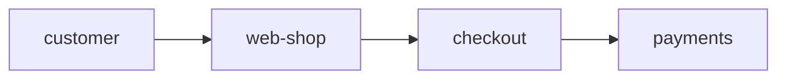

# Spec-driven change

The artifacts say what should be true. The running system is what is true. Your work is the
difference, and the order you close it in is not a preference.

## Before you write code

**Find which artifact the change belongs to, and change it first.**

| What is changing | Where it goes |
|---|---|
| Behaviour someone could observe from outside | An acceptance criterion, in the spec that owns it |
| A number that has to hold — latency, throughput, a limit | A non-functional requirement, with its measurement conditions |
| A component, a boundary, an interface | The architecture model |
| A mechanism that must be pinned and is none of the above | A waymark: in the spec's decisions section when it serves one spec, under `docs/waymarks/` when it serves none |

If you cannot tell which, **stop and ask**. Guessing puts the content in the wrong file,
where the people it was written for will not find it and the people it was not written for
will trip over it.

**Artifacts live at conventional paths, all under `docs/`.** A specification is a `.md` file
directly under `docs/specs/`, a waymark directly under `docs/waymarks/`, a principle directly
under `docs/principles/`, and an architecture model a `.json` file directly under
`docs/architecture/`. The model is a [FINOS CALM](https://calm.finos.org) document, checked
with `calm validate`. Nothing deeper and nothing elsewhere is an artifact.

These paths are arbitrary and that is exactly why they are fixed: their whole value is that
everyone picks the same ones. A repository that invents its own layout is one every other
tool has to be taught, and the artifacts stop being readable by anything but the person who
wrote them. Put a new artifact where the others are, and if this repository already keeps
them somewhere else, follow the repository.

**The tools are in this skill's folder.** Run them as
`node <this skill's folder>/tools/railyard.mjs <command>`, with Node 24 and git, and nothing else:
`ids-take 3` for three identifiers nothing here uses or ever has, `ids-resolve Ay4` for what one
names, `check` for everything the method holds the repository to, `links`, `link`, `unlink`
and `scan` for what the code implements, `trace <file>:<line>` to follow a line to the
requirements behind it, and `trace <ID>` for the code that implements one, `install` to install the skill in the project, `upgrade` to carry the
repository to this version, `tests-by-id` to carry Tests rows that name criteria by
number to their IDs, and `decisions-by-id` to number decisions that carry no ID.

**`.railyard/method.json` records which version of the method laid the repository out.** If
it names an older version than this skill's, run
`node <this skill's folder>/tools/railyard.mjs upgrade` before anything else.
It moves the artifacts whose paths have changed and lists the repository's own files that
still name an old path. Fix those as part of the same change, and say what you fixed. Tests
rows that name criteria by number are carried to IDs by `tests-by-id`, which `--dry-run`
previews; a row it cannot carry it names, and which criterion that row meant is yours to
decide. Decisions written as bullets or bold paragraphs are numbered with IDs by
`decisions-by-id`, the same way; where a list or a paragraph could belong to the decision
above it or be decisions of its own, it names the place, and which it is is yours to say.

### Find the requirement before you write the artifact

Most things that look like technical decisions are requirements nobody stated. Ask *why*
until the answer stops being **how** and becomes **what the product requires** — then write
the rung just above implementation, and not the ones above that.

> *Serve the fonts from our own host.* Why? So a page does not depend on a vendor. Why does
> that matter? A vendor would see every time the owner opens their work. Why do we care?
> The operator owns their data.

The third rung is what gets written. "The operator owns their data" is already a principle,
and restating it is noise. "Pin these packages at these weights" is below the cut, and
belongs to whoever implements it.

**A criterion states the requirement and nothing else,** even when the owner dictates it
with a mechanism and a story attached. No library, layer, parameter or file, and no account
of who asked, when, or what happened: a criterion naming a mechanism is read as requiring
it, and its story outlives its reason. A mechanism that must be pinned is a decision; who
decided and why is that decision's source, or git's.

**Below the cut, ask once more: could two competent implementations differ here, and would
it matter?** Usually no and no — let the tests hold whatever was chosen. Write it down only
when it is:

- **Forced** — one thing works because a system nobody here controls decides it. Record it
  **with the date and version you observed**, because it is a fact about someone else's
  software and it will expire.
- **Conventional** — many work, none is better, everyone must pick the same one. Record it
  because consistency is the whole of its value.
- **Hard-won** — several routes look fine and one is a trap whose cost arrives later and
  elsewhere. Record the hazard, its cost and its evidence.

Each of these is a waymark: a mark left on the route for whoever comes next.

**Post a hazard on the terrain, not on the traveller who found it.** "This function skips
that directory" is a sign at one trailhead; the next route in finds the same drop.

## Bringing the method to a repository

**Install the skill in the project first**, and whenever you are asked to: `install`. It
copies this skill into `.claude/skills/`, records the method in `.railyard/method.json` as
`{ "method": "1.0.3" }` (the key is `method`; a marker under any other key is read as no
marker at all), and adds the scan to `.claude/settings.json`, so every session in the
project runs it on every write, a shell command's as well as an edit's. A project installed
before the shell was scanned gains that scan when you run `install` again. It keeps whatever else the settings hold, and a second run
changes nothing. The scan is on from the next write, in any session started in the project;
a session started in another folder reads that folder's settings instead, and `install`
says so. Commit what it writes. Nothing else needs setting up, and nothing needs
copying from another repository: the shapes the tools read are all here.

**A spec is read by the tools as well as by people**, so its shape is fixed:

```markdown
# Export

**ID:** [Ab3]

## Acceptance criteria

1. [Cd4] An export of more than 10,000 rows runs in the background and emails its link.

## Non-functional requirements

- The link arrives within 5 minutes of the request, at p95, for exports up to a million rows.

## Decisions

1. [Ef5] **The link expires after 24 hours.** Forced: the mail provider keeps attachments
   no longer than that (observed 2026-09-24, its API v3).

## Tests

| Criterion | Test | Status |
|---|---|---|
| [Cd4] (a large export runs in the background) | `src/export/export.test.ts` | Written |
```

Take every ID from `ids-take`. A waymark that serves one spec is a numbered decision in its
`## Decisions`, with its own ID like a criterion's, and is cited by that ID. Every decision is
one: a bullet or a bold paragraph under `## Decisions` carries no ID, and `check` reports it.
Whatever a decision needs beyond its first paragraph, bullets or a view among it, goes
indented inside it. A Tests row
opens with the IDs of the criteria it covers, `[Cd4]` or several joined by commas, never
their numbers: a number names whichever criterion sits there after the list is reordered.
A row for the non-functional requirements opens with words instead. Its status
begins with one of **Passing, Written, Failing, Partial, Planned, Not yet written, Measured**
or **Withdrawn**, with anything else after the word as a note. A target the code does not
reach yet is Failing. Everything directly under `docs/specs/` is a spec; an index of them is
something a tool derives, not a file to keep in step.

**A number you measured is evidence, not a requirement.** It goes in the decision it
supports, dated and with how it was measured; where it supports none yet, in a findings
document the marker lists as dated, `"dated": ["docs/findings/"]`. Never in a criterion, a
requirement's text or a status: there it reads as the target, and goes stale unseen. `dated`
names the documents that record what was true on a date, which the checks and the upgrade
leave as written.

A waymark under `docs/waymarks/` has the same metadata line, then its context and its
decisions, each numbered with an ID:

```markdown
# Export links expire

**Date:** 2026-09-24 · **Source:** the mail provider's API v3 documentation · **ID:** [Ij7]

## Context

A large export is emailed as a link to a file we host.

## Decisions

1. [Kl8] **The link expires after 24 hours.** Forced: the provider keeps nothing longer.
2. [Mn9] **The file is zipped.** A million rows measured 212 MB raw, 31 MB zipped (2026-09-24).
```

**The architecture model is read by the tools too.** It carries its own ID in its
`metadata`, and each component owns its code through a `source-path`: one path, or a list.
Every source file lies under exactly one component's path, and an import from one
component's files into another's is a connection the model declares. `check` reads imports in
JavaScript, TypeScript and Python, a Python directory added to `sys.path` from `__file__` or
the repository's root among them, and notes any source whose imports it cannot read: a
notice there means that code's boundaries are yours to check by hand. `check` validates the
model with the CALM CLI, the one thing beyond Node and git it runs; where it is missing `check` says
so. The repository need not be a Node project: `npm install -g @finos/calm-cli` puts it on
the path, where `check` finds it, and `npx @finos/calm-cli validate` runs it once by hand. A model in the shape the tools
read:

```json
{
  "$schema": "https://calm.finos.org/release/1.0/meta/calm.json",
  "metadata": { "id": "Gh6" },
  "nodes": [
    { "unique-id": "web-shop", "node-type": "service", "name": "Web shop",
      "description": "Takes orders from customers.", "source-path": "src/shop" },
    { "unique-id": "payments", "node-type": "service", "name": "Payments",
      "description": "Charges a card for an order.", "source-path": ["src/payments", "src/cards.ts"] }
  ],
  "relationships": [
    { "unique-id": "shop-uses-payments", "description": "The shop charges through payments.",
      "relationship-type": { "connects": { "source": { "node": "web-shop" }, "destination": { "node": "payments" } } } }
  ]
}
```

**A set of specs comes with what describes the system.** Writing every spec for a system at
once is when the rest gets left for later. In the same piece of work:

- **the architecture model**, once there is more than one component. A spec about an
  adapter, a boundary or an interface is describing the model.
- **a waymark for each forced fact** the specs rest on, such as a stand-in the simulation
  uses, a vendor's limit or a pinned version, with the date and version you observed.
- **what the system is for**, once, as the system spec's `## Purpose`: whom it serves and
  why. Every chain of whys ends there, so no criterion restates it.
- **principles that hold for every decision**, and only those, in
  `docs/principles/principles.md`: an `**ID:**` line like a spec's, and each principle
  numbered `N. [ID]` like a criterion. A rule a spec already means to relax later is that
  spec's criterion.

Whatever you leave for later, say so in your report as unfinished.

## What the owner decides in conversation

**What the owner says lands in the artifacts, in the same turn, without being asked.**
Conversation is where most requirements and decisions are made, and it is the one place
nobody will look for them later.

- **A requirement stated** ("it has to hold the phone at the robot camera's height") is a
  criterion in the spec that owns it, with its Tests row, Planned if it is not built yet.
- **A choice among alternatives** ("let's use the ribbed pad", "drop Y") is a waymark: what
  was chosen, what it was chosen over, and the evidence it rests on, with each source
  cited, a vendor's figure dated and versioned. A number you took from research is
  evidence; say where it came from.
- **A choice reversed** is its decision rewritten where it stands, or deleted, and what
  cites it updated. Never mark a waymark Superseded or write one that supersedes another: a
  chain makes every reader walk it to learn what holds, and git keeps what changed.
- **A rule for every decision** is a principle, and a change of structure changes the
  model.

Then say which files changed, so the owner sees what landed. Exploring is not an exemption:
a design tried, measured and kept is a decision the moment it is kept.

## While you write code

**Test first, and watch it fail.** A test that passes the moment you write it has proved
nothing. If it passes immediately, say so rather than implying you watched it fail — you
have written a characterisation test, which is a different and lesser thing.

**Every acceptance criterion has a test.** A criterion with no test is a wish. Adding one
without its test leaves the artifact claiming something nothing holds it to.

**A code change with no artifact change is suspect.** Either it is a bug fix against an
existing criterion — in which case the missing test is part of the fix — or it is silent
divergence from the design. There is no third case.

**However far into a session.** After a few rounds of try, measure and keep, the next change
reads as more of the same code, and that is when its spec is skipped. A new behaviour is
still its criterion before its test and its code, and a design kept is its decision when it
is kept.

## Links from the code to what it implements

**Everything you name says what it implements.** Each function, class or method you write
implements a criterion or a waymark's decision. Say which as you write it:
`link <file>#<name> <ID>...`. Nobody can recover it afterwards, because the finished code
records what it does and never why. Links are kept under `symbols/links/`, one file per
source file, and committed with the code they describe. A test links to the criterion it
tests. A test written as a call is named by its title: `test("adds a bookmark", …)` is
`adds a bookmark`, and one inside `describe("search", …)` is `search.matches every word`.
A name with a space in it is quoted for the shell, target and all:
`link 'test/cli.test.ts#adds a bookmark' <ID>`. `links <file>` lists the names. Which component a file belongs to is the model's to say, by its source paths, not a
link's.

**Before you change a file, ask what it implements:** `links <file>`. Those are the
requirements your change can break.

**After every write, the scan says what your change did to the links.** The skill runs it
for you, and its report arrives with the write. Answer it in the same turn:

- **code that changed since it was linked:** if it still implements the same IDs, link it
  again to confirm; if not, link what it implements now, or unlink it;
- **a linked thing that is gone:** link whatever implements its IDs now;
- **something new and linked to nothing:** link it;
- **a file with no links at all:** it was never tracked. Link its things as you touch them,
  rather than stopping to link the whole repository.

**A write through the shell is a write.** After a command, the scan names what the command
changed; where it changed more than it can name in full, it says how many more, and
`scan <file>` answers each.

**After you change an artifact's text, the scan names the code linked to what you
changed.** If the code still does what the text now says, confirm each link with the
command it gives; if not, change the code, or unlink it, in the same turn.

**Never link to quiet the scan.** A link says what the code is for, and a wrong one is worse
than none, because a reader believes it. Code that implements nothing in any artifact is a
question to raise, as any code change with no artifact is. If no report arrives after you
write a file, the scan is not running: run `install`, and if it says this session was
started in another folder, run `scan <file>` yourself on what you change, and say so.

## Citations

**Cite by whatever stable identifier the repository uses, and never by position.** A name
and an ordinal both move: renaming a spec rewrites every reference to it, and an ordinal
names a different thing the moment one is inserted above it. An identifier that is set once
survives both, which is what makes renumbering and regrouping safe edits rather than
migrations.

**A citation belongs in a comment, never in a shipped string.** A message cites nothing its
reader cannot look up.

## Architecture diagrams

**The model and a diagram have different jobs.** The architecture model fixes the shape of
the system, so it holds every component and boundary, because the code is held to all of
them. A diagram is for a person, and a person cannot read the whole model at once. A picture
of forty components and eighty connections teaches nothing and documents nothing. It is the
most common way a diagram fails, and the one to avoid.

**Before you draw, name who it is for and what it has to do.** It might teach a newcomer how
the pieces fit, document a boundary for whoever changes it next, show how one request moves
through the system, or make a property visible enough to reason about, such as a trust
boundary or a failure path. If you cannot name the reader and the purpose, ask. Do not
draw everything to be safe.

**Then draw the one view that answers it, and nothing else.** The SEI's *Documenting
Software Architectures: Views and Beyond* gives the vocabulary:

- a **module** view shows how the code is divided, and what depends on what;
- a **component-and-connector** view shows what runs, and how the running pieces talk;
- an **allocation** view shows where it is deployed, or who builds which part.

Show only the elements the purpose needs. A view of more than about a dozen boxes is usually
two views, or one with a subsystem collapsed to a single box. Collapsed means the subsystem
*is* one box and its members are not drawn. Grouping every component into labelled boxes
within boxes still draws all of them: it is the whole model with borders round it, and just
as unreadable. Say what the boxes and lines mean. A view is written from its reader's point of view, not its author's.

**Put it in the artifact it clarifies.** A flow goes in the spec whose behaviour it shows,
and a design in the waymark that marks it. A separate diagrams document kept in step
by hand eventually is not.

**Keep an overview, without being asked.** A model of more than one component comes with
an overview in the system spec, drawn like any other view: for its reader, with only the
components that reader needs, a subsystem shown as its one box. When you add a component to
the model, change the view that should show it in the same piece of work; `check` says when
a component is in no view.

**Draw it from the model.** Name components and connections by the model's identifiers, and
take their names from it. A component the model does not have is a change to the model first,
not something a diagram can introduce. A view is written so the tools can hold it to the model:

````markdown

````

A view is drawn from the model's file or not at all: where you cannot read the model, say so
and ask for it, and do not lay out its components without their connections, which is the
whole model again with the arrows left out. The first line names the model it is drawn from. Each component is its bare identifier, and
the model gives its name. Each arrow is a connection the model declares, between the two components or between
anything each contains, so a subsystem collapsed to one box keeps the arrows of what is
inside it. Every component you draw carries its arrows: one drawn alone, where the model
connects it to another box in the view, is reported. A subsystem is drawn
as its one component; where a box is needed for a boundary, it is `subgraph` with the
model's identifier.

## When you find something wrong

**Report a divergence; do not quietly fix it.** When an artifact and the code disagree,
which one is wrong is a judgement, and it is not yours to make silently.

- **The architecture model wins by default.** Fix the code to match it.
- **For a spec, say what you found and let it go through the normal workflow.** A spec
  rewritten to match the code it was supposed to constrain has stopped constraining it.

**Never edit an artifact because it is hard to satisfy.** That is precisely when it must
not be touched, and precisely when an agent under pressure will touch it. An artifact you
believe is wrong is something to say out loud, not to edit your way out of.

## Before you say it is done

Read this list again now, and hold everything the session changed to it, not only the last
request: a long session is where an early change goes unrecorded.

- Every criterion you touched has a test, and you ran it.
- `check` finds nothing, or you have said what it found. A notice is not a clean result: a
  link a change left to answer is work, and `links <file>` on each file it names says what
  to do.
- Every file you changed has its links answered: `scan <file>` has nothing left to say.
- The artifacts and the code agree, or you have said where they do not.
- You have named what you did **not** finish. A partial job reported honestly is worth more
  than a task marked done that is not.

## What this skill will not do for you

It grants nothing and enforces nothing. Every rule here is advisory, and the ones that
genuinely must hold are enforced somewhere you cannot skip — a hook, a permission, a check
that fails the build. If you find yourself relying on this document to stop you doing
something dangerous, the rule is in the wrong place; say so.
